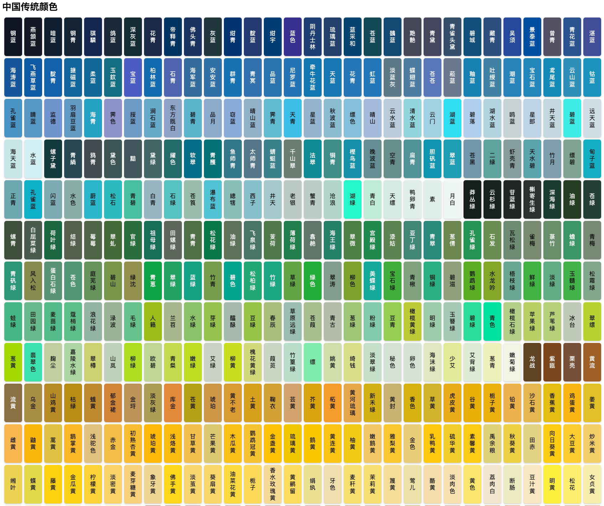

# ***thisplot*** 

<!-- badges: start -->

[](https://CRAN.R-project.org/package=thisplot) [](https://github.com/mengxu98/thisplot/) [](https://github.com/mengxu98/thisplot/actions/workflows/R-CMD-check.yaml) [](https://github.com/mengxu98/thisplot/actions/workflows/test-coverage.yaml) [](https://mengxu98.github.io/thisplot/reference/index.html) [](https://CRAN.R-project.org/package=thisplot)

<!-- badges: end -->

## **Introduction**

[thisplot](https://mengxu98.github.io/thisplot/) is an R package providing utility functions for data visualization and plotting. It includes tools for color manipulation (blending, conversion, palettes), plot customization (themes, grob operations, patchwork building), panel size control, data optimization for plots, and layout adjustments. Designed to enhance workflows with ggplot2, patchwork, and ComplexHeatmap.

## **Chinese traditional colors**

The package includes a comprehensive Chinese traditional color system with 1058 representative colors. You can access colors by name (pinyin or Chinese), create color palettes, and visualize color collections.

Example usage:

```r
library(thisplot)
cc <- ChineseColors()
cc$visual_colors(
  num_per_row = 30,
  title = "Chinese traditional colors",
  name_type = "chinese"
)
```



```r
show_palettes(
  palettes = get_chinese_palettes()
)
```


## **Installation**

Install CRAN version:

``` r
install.packages("thisplot")
# or
if (!require("pak", quietly = TRUE)) {
  install.packages("pak")
}
pak::pak("thisplot")
```

Install development version from [GitHub](https://github.com/mengxu98/thisplot) use [pak](https://github.com/r-lib/pak):

``` r
if (!require("pak", quietly = TRUE)) {
  install.packages("pak")
}
pak::pak("mengxu98/thisplot")
```

## **Usage**

Please reference [here](https://mengxu98.github.io/thisplot/reference/index.html).
