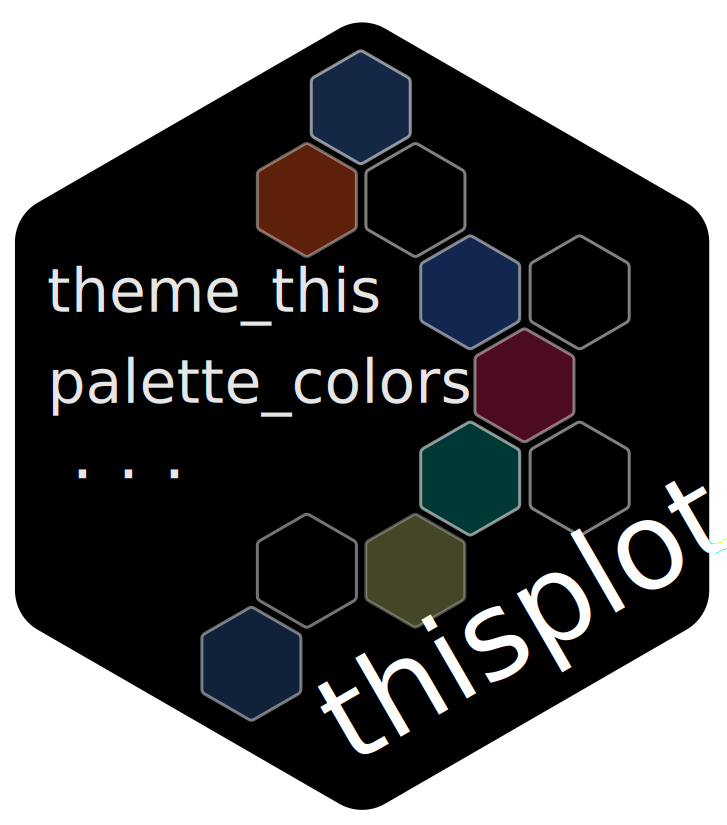

<!-- README.md is generated from README.Rmd. Please edit that file -->

# **thisplot** 

<!-- badges: start -->

[](https://CRAN.R-project.org/package=thisplot)
[](https://github.com/mengxu98/thisplot/blob/main/DESCRIPTION)
[](https://github.com/mengxu98/thisplot/actions/workflows/R-CMD-check.yaml)
[](https://github.com/mengxu98/thisplot/actions/workflows/test-coverage.yaml)
[](https://mengxu98.github.io/thisplot/reference/index.html)
[](https://CRAN.R-project.org/package=thisplot)

<!-- badges: end -->

## **Introduction**

[thisplot](https://mengxu98.github.io/thisplot/) is an *R* package
providing utility functions for data visualization and plotting. It
includes tools for color manipulation (blending, conversion, palettes),
plot customization (themes, grob operations, patchwork building), panel
size control, data optimization for plots, and layout adjustments.
Designed to enhance workflows with
[ggplot2](https://github.com/tidyverse/ggplot2),
[patchwork](https://github.com/thomasp85/patchwork), and
[ComplexHeatmap](https://github.com/jokergoo/ComplexHeatmap).

## **Chinese traditional colors**

[thisplot](https://mengxu98.github.io/thisplot/) provides a
comprehensive *Chinese traditional color* system with **1058**
representative colors. Use `ChineseColors()` to create a color object,
access colors by name (pinyin or Chinese), visualize the collection with
`visual_colors()`, and retrieve specific palettes using `get_colors()`.

Example usage:

``` r
library(thisplot)
cc <- ChineseColors()
cc
#> 
#> ── Chinese Traditional Colors System
#> 
#> ── Total 1058 colors
#> • blue: 92 colors
#> • cyan: 51 colors
#> • gray_brown: 323 colors
#> • green: 123 colors
#> • orange: 92 colors
#> • purple: 95 colors
#> • red: 181 colors
#> • yellow: 101 colors
#> 
#> ── Methods:
#> • visual_colors(loc_range, num_per_row, title, name_type)
#> 
#> ── See also:
#> • [get_colors()] for searching colors
```

``` r
cc$visual_colors(
  loc_range = c(1, 180),
  num_per_row = 30,
  title = "Chinese traditional colors",
  name_type = "chinese"
)
```

<div style="background:transparent;padding:12px;border-radius:12px;border:1px solid rgba(0,0,0,0.1);box-shadow:none;display:inline-block;overflow-x:auto;">
<div style="font-family:&#39;Noto Sans SC&#39;,&#39;PingFang SC&#39;,&#39;Microsoft YaHei&#39;,sans-serif;font-size:13px;font-weight:600;color:inherit;margin-bottom:3px;">Chinese traditional colors</div>
<table style="border-collapse:separate;border-spacing:3px;">
<tbody>
<tr>
<td style="padding:1px;width:21px;min-width:21px;max-width:21px;height:50px;min-height:50px;border-radius:3px;background:#D2F0F4;box-shadow:0 1px 2px rgba(0,0,0,0.2);text-align:center;vertical-align:middle;position:relative;overflow:hidden;box-sizing:border-box;">
<div style="display:flex;align-items:center;justify-content:center;width:100%;height:100%;box-sizing:border-box;padding:2px 0;">
<div style="color:#000000;font-size:8px;font-family:&#39;Noto Sans SC&#39;,&#39;PingFang SC&#39;,&#39;Microsoft YaHei&#39;,sans-serif;letter-spacing:0.2px;line-height:1.08;font-weight:500;display:block;text-align:center;width:100%;white-space:normal;">水<br>蓝</div>
</div>
</td>
<td style="padding:1px;width:21px;min-width:21px;max-width:21px;height:50px;min-height:50px;border-radius:3px;background:#C6E6E8;box-shadow:0 1px 2px rgba(0,0,0,0.2);text-align:center;vertical-align:middle;position:relative;overflow:hidden;box-sizing:border-box;">
<div style="display:flex;align-items:center;justify-content:center;width:100%;height:100%;box-sizing:border-box;padding:2px 0;">
<div style="color:#000000;font-size:8px;font-family:&#39;Noto Sans SC&#39;,&#39;PingFang SC&#39;,&#39;Microsoft YaHei&#39;,sans-serif;letter-spacing:0.2px;line-height:1.08;font-weight:500;display:block;text-align:center;width:100%;white-space:normal;">海<br>天<br>蓝</div>
</div>
</td>
<td style="padding:1px;width:21px;min-width:21px;max-width:21px;height:50px;min-height:50px;border-radius:3px;background:#B0D5DF;box-shadow:0 1px 2px rgba(0,0,0,0.2);text-align:center;vertical-align:middle;position:relative;overflow:hidden;box-sizing:border-box;">
<div style="display:flex;align-items:center;justify-content:center;width:100%;height:100%;box-sizing:border-box;padding:2px 0;">
<div style="color:#000000;font-size:8px;font-family:&#39;Noto Sans SC&#39;,&#39;PingFang SC&#39;,&#39;Microsoft YaHei&#39;,sans-serif;letter-spacing:0.2px;line-height:1.08;font-weight:500;display:block;text-align:center;width:100%;white-space:normal;">湖<br>水<br>蓝</div>
</div>
</td>
<td style="padding:1px;width:21px;min-width:21px;max-width:21px;height:50px;min-height:50px;border-radius:3px;background:#A2D2E2;box-shadow:0 1px 2px rgba(0,0,0,0.2);text-align:center;vertical-align:middle;position:relative;overflow:hidden;box-sizing:border-box;">
<div style="display:flex;align-items:center;justify-content:center;width:100%;height:100%;box-sizing:border-box;padding:2px 0;">
<div style="color:#000000;font-size:8px;font-family:&#39;Noto Sans SC&#39;,&#39;PingFang SC&#39;,&#39;Microsoft YaHei&#39;,sans-serif;letter-spacing:0.2px;line-height:1.08;font-weight:500;display:block;text-align:center;width:100%;white-space:normal;">云<br>门</div>
</div>
</td>
<td style="padding:1px;width:21px;min-width:21px;max-width:21px;height:50px;min-height:50px;border-radius:3px;background:#85C0DB;box-shadow:0 1px 2px rgba(0,0,0,0.2);text-align:center;vertical-align:middle;position:relative;overflow:hidden;box-sizing:border-box;">
<div style="display:flex;align-items:center;justify-content:center;width:100%;height:100%;box-sizing:border-box;padding:2px 0;">
<div style="color:#000000;font-size:8px;font-family:&#39;Noto Sans SC&#39;,&#39;PingFang SC&#39;,&#39;Microsoft YaHei&#39;,sans-serif;letter-spacing:0.2px;line-height:1.08;font-weight:500;display:block;text-align:center;width:100%;white-space:normal;">缥<br>色</div>
</div>
</td>
<td style="padding:1px;width:21px;min-width:21px;max-width:21px;height:50px;min-height:50px;border-radius:3px;background:#8ABCD1;box-shadow:0 1px 2px rgba(0,0,0,0.2);text-align:center;vertical-align:middle;position:relative;overflow:hidden;box-sizing:border-box;">
<div style="display:flex;align-items:center;justify-content:center;width:100%;height:100%;box-sizing:border-box;padding:2px 0;">
<div style="color:#000000;font-size:8px;font-family:&#39;Noto Sans SC&#39;,&#39;PingFang SC&#39;,&#39;Microsoft YaHei&#39;,sans-serif;letter-spacing:0.2px;line-height:1.08;font-weight:500;display:block;text-align:center;width:100%;white-space:normal;">秋<br>波<br>蓝</div>
</div>
</td>
<td style="padding:1px;width:21px;min-width:21px;max-width:21px;height:50px;min-height:50px;border-radius:3px;background:#8FB2C9;box-shadow:0 1px 2px rgba(0,0,0,0.2);text-align:center;vertical-align:middle;position:relative;overflow:hidden;box-sizing:border-box;">
<div style="display:flex;align-items:center;justify-content:center;width:100%;height:100%;box-sizing:border-box;padding:2px 0;">
<div style="color:#000000;font-size:8px;font-family:&#39;Noto Sans SC&#39;,&#39;PingFang SC&#39;,&#39;Microsoft YaHei&#39;,sans-serif;letter-spacing:0.2px;line-height:1.08;font-weight:500;display:block;text-align:center;width:100%;white-space:normal;">晴<br>山<br>蓝</div>
</div>
</td>
<td style="padding:1px;width:21px;min-width:21px;max-width:21px;height:50px;min-height:50px;border-radius:3px;background:#93B5CF;box-shadow:0 1px 2px rgba(0,0,0,0.2);text-align:center;vertical-align:middle;position:relative;overflow:hidden;box-sizing:border-box;">
<div style="display:flex;align-items:center;justify-content:center;width:100%;height:100%;box-sizing:border-box;padding:2px 0;">
<div style="color:#000000;font-size:8px;font-family:&#39;Noto Sans SC&#39;,&#39;PingFang SC&#39;,&#39;Microsoft YaHei&#39;,sans-serif;letter-spacing:0.2px;line-height:1.08;font-weight:500;display:block;text-align:center;width:100%;white-space:normal;">星<br>蓝</div>
</div>
</td>
<td style="padding:1px;width:21px;min-width:21px;max-width:21px;height:50px;min-height:50px;border-radius:3px;background:#8AABCC;box-shadow:0 1px 2px rgba(0,0,0,0.2);text-align:center;vertical-align:middle;position:relative;overflow:hidden;box-sizing:border-box;">
<div style="display:flex;align-items:center;justify-content:center;width:100%;height:100%;box-sizing:border-box;padding:2px 0;">
<div style="color:#000000;font-size:8px;font-family:&#39;Noto Sans SC&#39;,&#39;PingFang SC&#39;,&#39;Microsoft YaHei&#39;,sans-serif;letter-spacing:0.2px;line-height:1.08;font-weight:500;display:block;text-align:center;width:100%;white-space:normal;">品<br>月</div>
</div>
</td>
<td style="padding:1px;width:21px;min-width:21px;max-width:21px;height:50px;min-height:50px;border-radius:3px;background:#8BA3C7;box-shadow:0 1px 2px rgba(0,0,0,0.2);text-align:center;vertical-align:middle;position:relative;overflow:hidden;box-sizing:border-box;">
<div style="display:flex;align-items:center;justify-content:center;width:100%;height:100%;box-sizing:border-box;padding:2px 0;">
<div style="color:#000000;font-size:8px;font-family:&#39;Noto Sans SC&#39;,&#39;PingFang SC&#39;,&#39;Microsoft YaHei&#39;,sans-serif;letter-spacing:0.2px;line-height:1.08;font-weight:500;display:block;text-align:center;width:100%;white-space:normal;">东<br>方<br>既<br>白</div>
</div>
</td>
<td style="padding:1px;width:21px;min-width:21px;max-width:21px;height:50px;min-height:50px;border-radius:3px;background:#88ABDA;box-shadow:0 1px 2px rgba(0,0,0,0.2);text-align:center;vertical-align:middle;position:relative;overflow:hidden;box-sizing:border-box;">
<div style="display:flex;align-items:center;justify-content:center;width:100%;height:100%;box-sizing:border-box;padding:2px 0;">
<div style="color:#000000;font-size:8px;font-family:&#39;Noto Sans SC&#39;,&#39;PingFang SC&#39;,&#39;Microsoft YaHei&#39;,sans-serif;letter-spacing:0.2px;line-height:1.08;font-weight:500;display:block;text-align:center;width:100%;white-space:normal;">窃<br>蓝</div>
</div>
</td>
<td style="padding:1px;width:21px;min-width:21px;max-width:21px;height:50px;min-height:50px;border-radius:3px;background:#6E9BC5;box-shadow:0 1px 2px rgba(0,0,0,0.2);text-align:center;vertical-align:middle;position:relative;overflow:hidden;box-sizing:border-box;">
<div style="display:flex;align-items:center;justify-content:center;width:100%;height:100%;box-sizing:border-box;padding:2px 0;">
<div style="color:#000000;font-size:8px;font-family:&#39;Noto Sans SC&#39;,&#39;PingFang SC&#39;,&#39;Microsoft YaHei&#39;,sans-serif;letter-spacing:0.2px;line-height:1.08;font-weight:500;display:block;text-align:center;width:100%;white-space:normal;">挼<br>蓝</div>
</div>
</td>
<td style="padding:1px;width:21px;min-width:21px;max-width:21px;height:50px;min-height:50px;border-radius:3px;background:#619AC3;box-shadow:0 1px 2px rgba(0,0,0,0.2);text-align:center;vertical-align:middle;position:relative;overflow:hidden;box-sizing:border-box;">
<div style="display:flex;align-items:center;justify-content:center;width:100%;height:100%;box-sizing:border-box;padding:2px 0;">
<div style="color:#000000;font-size:8px;font-family:&#39;Noto Sans SC&#39;,&#39;PingFang SC&#39;,&#39;Microsoft YaHei&#39;,sans-serif;letter-spacing:0.2px;line-height:1.08;font-weight:500;display:block;text-align:center;width:100%;white-space:normal;">羽<br>扇<br>豆<br>蓝</div>
</div>
</td>
<td style="padding:1px;width:21px;min-width:21px;max-width:21px;height:50px;min-height:50px;border-radius:3px;background:#5698C3;box-shadow:0 1px 2px rgba(0,0,0,0.2);text-align:center;vertical-align:middle;position:relative;overflow:hidden;box-sizing:border-box;">
<div style="display:flex;align-items:center;justify-content:center;width:100%;height:100%;box-sizing:border-box;padding:2px 0;">
<div style="color:#000000;font-size:8px;font-family:&#39;Noto Sans SC&#39;,&#39;PingFang SC&#39;,&#39;Microsoft YaHei&#39;,sans-serif;letter-spacing:0.2px;line-height:1.08;font-weight:500;display:block;text-align:center;width:100%;white-space:normal;">睛<br>蓝</div>
</div>
</td>
<td style="padding:1px;width:21px;min-width:21px;max-width:21px;height:50px;min-height:50px;border-radius:3px;background:#4994C4;box-shadow:0 1px 2px rgba(0,0,0,0.2);text-align:center;vertical-align:middle;position:relative;overflow:hidden;box-sizing:border-box;">
<div style="display:flex;align-items:center;justify-content:center;width:100%;height:100%;box-sizing:border-box;padding:2px 0;">
<div style="color:#000000;font-size:8px;font-family:&#39;Noto Sans SC&#39;,&#39;PingFang SC&#39;,&#39;Microsoft YaHei&#39;,sans-serif;letter-spacing:0.2px;line-height:1.08;font-weight:500;display:block;text-align:center;width:100%;white-space:normal;">孔<br>雀<br>蓝</div>
</div>
</td>
<td style="padding:1px;width:21px;min-width:21px;max-width:21px;height:50px;min-height:50px;border-radius:3px;background:#2486B9;box-shadow:0 1px 2px rgba(0,0,0,0.2);text-align:center;vertical-align:middle;position:relative;overflow:hidden;box-sizing:border-box;">
<div style="display:flex;align-items:center;justify-content:center;width:100%;height:100%;box-sizing:border-box;padding:2px 0;">
<div style="color:#FFFFFF;font-size:8px;font-family:&#39;Noto Sans SC&#39;,&#39;PingFang SC&#39;,&#39;Microsoft YaHei&#39;,sans-serif;letter-spacing:0.2px;line-height:1.08;font-weight:500;display:block;text-align:center;width:100%;white-space:normal;">宝<br>石<br>蓝</div>
</div>
</td>
<td style="padding:1px;width:21px;min-width:21px;max-width:21px;height:50px;min-height:50px;border-radius:3px;background:#1781B5;box-shadow:0 1px 2px rgba(0,0,0,0.2);text-align:center;vertical-align:middle;position:relative;overflow:hidden;box-sizing:border-box;">
<div style="display:flex;align-items:center;justify-content:center;width:100%;height:100%;box-sizing:border-box;padding:2px 0;">
<div style="color:#FFFFFF;font-size:8px;font-family:&#39;Noto Sans SC&#39;,&#39;PingFang SC&#39;,&#39;Microsoft YaHei&#39;,sans-serif;letter-spacing:0.2px;line-height:1.08;font-weight:500;display:block;text-align:center;width:100%;white-space:normal;">釉<br>蓝</div>
</div>
</td>
<td style="padding:1px;width:21px;min-width:21px;max-width:21px;height:50px;min-height:50px;border-radius:3px;background:#2983BB;box-shadow:0 1px 2px rgba(0,0,0,0.2);text-align:center;vertical-align:middle;position:relative;overflow:hidden;box-sizing:border-box;">
<div style="display:flex;align-items:center;justify-content:center;width:100%;height:100%;box-sizing:border-box;padding:2px 0;">
<div style="color:#FFFFFF;font-size:8px;font-family:&#39;Noto Sans SC&#39;,&#39;PingFang SC&#39;,&#39;Microsoft YaHei&#39;,sans-serif;letter-spacing:0.2px;line-height:1.08;font-weight:500;display:block;text-align:center;width:100%;white-space:normal;">潮<br>蓝</div>
</div>
</td>
<td style="padding:1px;width:21px;min-width:21px;max-width:21px;height:50px;min-height:50px;border-radius:3px;background:#1177B0;box-shadow:0 1px 2px rgba(0,0,0,0.2);text-align:center;vertical-align:middle;position:relative;overflow:hidden;box-sizing:border-box;">
<div style="display:flex;align-items:center;justify-content:center;width:100%;height:100%;box-sizing:border-box;padding:2px 0;">
<div style="color:#FFFFFF;font-size:8px;font-family:&#39;Noto Sans SC&#39;,&#39;PingFang SC&#39;,&#39;Microsoft YaHei&#39;,sans-serif;letter-spacing:0.2px;line-height:1.08;font-weight:500;display:block;text-align:center;width:100%;white-space:normal;">牵<br>牛<br>花<br>蓝</div>
</div>
</td>
<td style="padding:1px;width:21px;min-width:21px;max-width:21px;height:50px;min-height:50px;border-radius:3px;background:#1677B3;box-shadow:0 1px 2px rgba(0,0,0,0.2);text-align:center;vertical-align:middle;position:relative;overflow:hidden;box-sizing:border-box;">
<div style="display:flex;align-items:center;justify-content:center;width:100%;height:100%;box-sizing:border-box;padding:2px 0;">
<div style="color:#FFFFFF;font-size:8px;font-family:&#39;Noto Sans SC&#39;,&#39;PingFang SC&#39;,&#39;Microsoft YaHei&#39;,sans-serif;letter-spacing:0.2px;line-height:1.08;font-weight:500;display:block;text-align:center;width:100%;white-space:normal;">天<br>蓝</div>
</div>
</td>
<td style="padding:1px;width:21px;min-width:21px;max-width:21px;height:50px;min-height:50px;border-radius:3px;background:#2B73AF;box-shadow:0 1px 2px rgba(0,0,0,0.2);text-align:center;vertical-align:middle;position:relative;overflow:hidden;box-sizing:border-box;">
<div style="display:flex;align-items:center;justify-content:center;width:100%;height:100%;box-sizing:border-box;padding:2px 0;">
<div style="color:#FFFFFF;font-size:8px;font-family:&#39;Noto Sans SC&#39;,&#39;PingFang SC&#39;,&#39;Microsoft YaHei&#39;,sans-serif;letter-spacing:0.2px;line-height:1.08;font-weight:500;display:block;text-align:center;width:100%;white-space:normal;">品<br>蓝</div>
</div>
</td>
<td style="padding:1px;width:21px;min-width:21px;max-width:21px;height:50px;min-height:50px;border-radius:3px;background:#3271AE;box-shadow:0 1px 2px rgba(0,0,0,0.2);text-align:center;vertical-align:middle;position:relative;overflow:hidden;box-sizing:border-box;">
<div style="display:flex;align-items:center;justify-content:center;width:100%;height:100%;box-sizing:border-box;padding:2px 0;">
<div style="color:#FFFFFF;font-size:8px;font-family:&#39;Noto Sans SC&#39;,&#39;PingFang SC&#39;,&#39;Microsoft YaHei&#39;,sans-serif;letter-spacing:0.2px;line-height:1.08;font-weight:500;display:block;text-align:center;width:100%;white-space:normal;">青<br>冥</div>
</div>
</td>
<td style="padding:1px;width:21px;min-width:21px;max-width:21px;height:50px;min-height:50px;border-radius:3px;background:#2474B5;box-shadow:0 1px 2px rgba(0,0,0,0.2);text-align:center;vertical-align:middle;position:relative;overflow:hidden;box-sizing:border-box;">
<div style="display:flex;align-items:center;justify-content:center;width:100%;height:100%;box-sizing:border-box;padding:2px 0;">
<div style="color:#FFFFFF;font-size:8px;font-family:&#39;Noto Sans SC&#39;,&#39;PingFang SC&#39;,&#39;Microsoft YaHei&#39;,sans-serif;letter-spacing:0.2px;line-height:1.08;font-weight:500;display:block;text-align:center;width:100%;white-space:normal;">尼<br>罗<br>蓝</div>
</div>
</td>
<td style="padding:1px;width:21px;min-width:21px;max-width:21px;height:50px;min-height:50px;border-radius:3px;background:#2376B7;box-shadow:0 1px 2px rgba(0,0,0,0.2);text-align:center;vertical-align:middle;position:relative;overflow:hidden;box-sizing:border-box;">
<div style="display:flex;align-items:center;justify-content:center;width:100%;height:100%;box-sizing:border-box;padding:2px 0;">
<div style="color:#FFFFFF;font-size:8px;font-family:&#39;Noto Sans SC&#39;,&#39;PingFang SC&#39;,&#39;Microsoft YaHei&#39;,sans-serif;letter-spacing:0.2px;line-height:1.08;font-weight:500;display:block;text-align:center;width:100%;white-space:normal;">花<br>青</div>
</div>
</td>
<td style="padding:1px;width:21px;min-width:21px;max-width:21px;height:50px;min-height:50px;border-radius:3px;background:#2177B8;box-shadow:0 1px 2px rgba(0,0,0,0.2);text-align:center;vertical-align:middle;position:relative;overflow:hidden;box-sizing:border-box;">
<div style="display:flex;align-items:center;justify-content:center;width:100%;height:100%;box-sizing:border-box;padding:2px 0;">
<div style="color:#FFFFFF;font-size:8px;font-family:&#39;Noto Sans SC&#39;,&#39;PingFang SC&#39;,&#39;Microsoft YaHei&#39;,sans-serif;letter-spacing:0.2px;line-height:1.08;font-weight:500;display:block;text-align:center;width:100%;white-space:normal;">虹<br>蓝</div>
</div>
</td>
<td style="padding:1px;width:21px;min-width:21px;max-width:21px;height:50px;min-height:50px;border-radius:3px;background:#1772B4;box-shadow:0 1px 2px rgba(0,0,0,0.2);text-align:center;vertical-align:middle;position:relative;overflow:hidden;box-sizing:border-box;">
<div style="display:flex;align-items:center;justify-content:center;width:100%;height:100%;box-sizing:border-box;padding:2px 0;">
<div style="color:#FFFFFF;font-size:8px;font-family:&#39;Noto Sans SC&#39;,&#39;PingFang SC&#39;,&#39;Microsoft YaHei&#39;,sans-serif;letter-spacing:0.2px;line-height:1.08;font-weight:500;display:block;text-align:center;width:100%;white-space:normal;">群<br>青</div>
</div>
</td>
<td style="padding:1px;width:21px;min-width:21px;max-width:21px;height:50px;min-height:50px;border-radius:3px;background:#126BAE;box-shadow:0 1px 2px rgba(0,0,0,0.2);text-align:center;vertical-align:middle;position:relative;overflow:hidden;box-sizing:border-box;">
<div style="display:flex;align-items:center;justify-content:center;width:100%;height:100%;box-sizing:border-box;padding:2px 0;">
<div style="color:#FFFFFF;font-size:8px;font-family:&#39;Noto Sans SC&#39;,&#39;PingFang SC&#39;,&#39;Microsoft YaHei&#39;,sans-serif;letter-spacing:0.2px;line-height:1.08;font-weight:500;display:block;text-align:center;width:100%;white-space:normal;">柏<br>林<br>蓝</div>
</div>
</td>
<td style="padding:1px;width:21px;min-width:21px;max-width:21px;height:50px;min-height:50px;border-radius:3px;background:#1661AB;box-shadow:0 1px 2px rgba(0,0,0,0.2);text-align:center;vertical-align:middle;position:relative;overflow:hidden;box-sizing:border-box;">
<div style="display:flex;align-items:center;justify-content:center;width:100%;height:100%;box-sizing:border-box;padding:2px 0;">
<div style="color:#FFFFFF;font-size:8px;font-family:&#39;Noto Sans SC&#39;,&#39;PingFang SC&#39;,&#39;Microsoft YaHei&#39;,sans-serif;letter-spacing:0.2px;line-height:1.08;font-weight:500;display:block;text-align:center;width:100%;white-space:normal;">靛<br>青</div>
</div>
</td>
<td style="padding:1px;width:21px;min-width:21px;max-width:21px;height:50px;min-height:50px;border-radius:3px;background:#0F59A4;box-shadow:0 1px 2px rgba(0,0,0,0.2);text-align:center;vertical-align:middle;position:relative;overflow:hidden;box-sizing:border-box;">
<div style="display:flex;align-items:center;justify-content:center;width:100%;height:100%;box-sizing:border-box;padding:2px 0;">
<div style="color:#FFFFFF;font-size:8px;font-family:&#39;Noto Sans SC&#39;,&#39;PingFang SC&#39;,&#39;Microsoft YaHei&#39;,sans-serif;letter-spacing:0.2px;line-height:1.08;font-weight:500;display:block;text-align:center;width:100%;white-space:normal;">飞<br>燕<br>草<br>蓝</div>
</div>
</td>
<td style="padding:1px;width:21px;min-width:21px;max-width:21px;height:50px;min-height:50px;border-radius:3px;background:#15559A;box-shadow:0 1px 2px rgba(0,0,0,0.2);text-align:center;vertical-align:middle;position:relative;overflow:hidden;box-sizing:border-box;">
<div style="display:flex;align-items:center;justify-content:center;width:100%;height:100%;box-sizing:border-box;padding:2px 0;">
<div style="color:#FFFFFF;font-size:8px;font-family:&#39;Noto Sans SC&#39;,&#39;PingFang SC&#39;,&#39;Microsoft YaHei&#39;,sans-serif;letter-spacing:0.2px;line-height:1.08;font-weight:500;display:block;text-align:center;width:100%;white-space:normal;">海<br>涛<br>蓝</div>
</div>
</td>
</tr>
<tr>
<td style="padding:1px;width:21px;min-width:21px;max-width:21px;height:50px;min-height:50px;border-radius:3px;background:#2A5390;box-shadow:0 1px 2px rgba(0,0,0,0.2);text-align:center;vertical-align:middle;position:relative;overflow:hidden;box-sizing:border-box;">
<div style="display:flex;align-items:center;justify-content:center;width:100%;height:100%;box-sizing:border-box;padding:2px 0;">
<div style="color:#FFFFFF;font-size:8px;font-family:&#39;Noto Sans SC&#39;,&#39;PingFang SC&#39;,&#39;Microsoft YaHei&#39;,sans-serif;letter-spacing:0.2px;line-height:1.08;font-weight:500;display:block;text-align:center;width:100%;white-space:normal;">青<br>花<br>蓝</div>
</div>
</td>
<td style="padding:1px;width:21px;min-width:21px;max-width:21px;height:50px;min-height:50px;border-radius:3px;background:#2E4E7E;box-shadow:0 1px 2px rgba(0,0,0,0.2);text-align:center;vertical-align:middle;position:relative;overflow:hidden;box-sizing:border-box;">
<div style="display:flex;align-items:center;justify-content:center;width:100%;height:100%;box-sizing:border-box;padding:2px 0;">
<div style="color:#FFFFFF;font-size:8px;font-family:&#39;Noto Sans SC&#39;,&#39;PingFang SC&#39;,&#39;Microsoft YaHei&#39;,sans-serif;letter-spacing:0.2px;line-height:1.08;font-weight:500;display:block;text-align:center;width:100%;white-space:normal;">藏<br>青</div>
</div>
</td>
<td style="padding:1px;width:21px;min-width:21px;max-width:21px;height:50px;min-height:50px;border-radius:3px;background:#22406A;box-shadow:0 1px 2px rgba(0,0,0,0.2);text-align:center;vertical-align:middle;position:relative;overflow:hidden;box-sizing:border-box;">
<div style="display:flex;align-items:center;justify-content:center;width:100%;height:100%;box-sizing:border-box;padding:2px 0;">
<div style="color:#FFFFFF;font-size:8px;font-family:&#39;Noto Sans SC&#39;,&#39;PingFang SC&#39;,&#39;Microsoft YaHei&#39;,sans-serif;letter-spacing:0.2px;line-height:1.08;font-weight:500;display:block;text-align:center;width:100%;white-space:normal;">琉<br>璃<br>蓝</div>
</div>
</td>
<td style="padding:1px;width:21px;min-width:21px;max-width:21px;height:50px;min-height:50px;border-radius:3px;background:#06436F;box-shadow:0 1px 2px rgba(0,0,0,0.2);text-align:center;vertical-align:middle;position:relative;overflow:hidden;box-sizing:border-box;">
<div style="display:flex;align-items:center;justify-content:center;width:100%;height:100%;box-sizing:border-box;padding:2px 0;">
<div style="color:#FFFFFF;font-size:8px;font-family:&#39;Noto Sans SC&#39;,&#39;PingFang SC&#39;,&#39;Microsoft YaHei&#39;,sans-serif;letter-spacing:0.2px;line-height:1.08;font-weight:500;display:block;text-align:center;width:100%;white-space:normal;">蓝<br>采<br>和</div>
</div>
</td>
<td style="padding:1px;width:21px;min-width:21px;max-width:21px;height:50px;min-height:50px;border-radius:3px;background:#144A74;box-shadow:0 1px 2px rgba(0,0,0,0.2);text-align:center;vertical-align:middle;position:relative;overflow:hidden;box-sizing:border-box;">
<div style="display:flex;align-items:center;justify-content:center;width:100%;height:100%;box-sizing:border-box;padding:2px 0;">
<div style="color:#FFFFFF;font-size:8px;font-family:&#39;Noto Sans SC&#39;,&#39;PingFang SC&#39;,&#39;Microsoft YaHei&#39;,sans-serif;letter-spacing:0.2px;line-height:1.08;font-weight:500;display:block;text-align:center;width:100%;white-space:normal;">鷃<br>蓝</div>
</div>
</td>
<td style="padding:1px;width:21px;min-width:21px;max-width:21px;height:50px;min-height:50px;border-radius:3px;background:#12507B;box-shadow:0 1px 2px rgba(0,0,0,0.2);text-align:center;vertical-align:middle;position:relative;overflow:hidden;box-sizing:border-box;">
<div style="display:flex;align-items:center;justify-content:center;width:100%;height:100%;box-sizing:border-box;padding:2px 0;">
<div style="color:#FFFFFF;font-size:8px;font-family:&#39;Noto Sans SC&#39;,&#39;PingFang SC&#39;,&#39;Microsoft YaHei&#39;,sans-serif;letter-spacing:0.2px;line-height:1.08;font-weight:500;display:block;text-align:center;width:100%;white-space:normal;">碧<br>城</div>
</div>
</td>
<td style="padding:1px;width:21px;min-width:21px;max-width:21px;height:50px;min-height:50px;border-radius:3px;background:#354E6B;box-shadow:0 1px 2px rgba(0,0,0,0.2);text-align:center;vertical-align:middle;position:relative;overflow:hidden;box-sizing:border-box;">
<div style="display:flex;align-items:center;justify-content:center;width:100%;height:100%;box-sizing:border-box;padding:2px 0;">
<div style="color:#FFFFFF;font-size:8px;font-family:&#39;Noto Sans SC&#39;,&#39;PingFang SC&#39;,&#39;Microsoft YaHei&#39;,sans-serif;letter-spacing:0.2px;line-height:1.08;font-weight:500;display:block;text-align:center;width:100%;white-space:normal;">青<br>雀<br>头<br>黛</div>
</div>
</td>
<td style="padding:1px;width:21px;min-width:21px;max-width:21px;height:50px;min-height:50px;border-radius:3px;background:#45465E;box-shadow:0 1px 2px rgba(0,0,0,0.2);text-align:center;vertical-align:middle;position:relative;overflow:hidden;box-sizing:border-box;">
<div style="display:flex;align-items:center;justify-content:center;width:100%;height:100%;box-sizing:border-box;padding:2px 0;">
<div style="color:#FFFFFF;font-size:8px;font-family:&#39;Noto Sans SC&#39;,&#39;PingFang SC&#39;,&#39;Microsoft YaHei&#39;,sans-serif;letter-spacing:0.2px;line-height:1.08;font-weight:500;display:block;text-align:center;width:100%;white-space:normal;">青<br>黛</div>
</div>
</td>
<td style="padding:1px;width:21px;min-width:21px;max-width:21px;height:50px;min-height:50px;border-radius:3px;background:#454659;box-shadow:0 1px 2px rgba(0,0,0,0.2);text-align:center;vertical-align:middle;position:relative;overflow:hidden;box-sizing:border-box;">
<div style="display:flex;align-items:center;justify-content:center;width:100%;height:100%;box-sizing:border-box;padding:2px 0;">
<div style="color:#FFFFFF;font-size:8px;font-family:&#39;Noto Sans SC&#39;,&#39;PingFang SC&#39;,&#39;Microsoft YaHei&#39;,sans-serif;letter-spacing:0.2px;line-height:1.08;font-weight:500;display:block;text-align:center;width:100%;white-space:normal;">䒌<br>靘</div>
</div>
</td>
<td style="padding:1px;width:21px;min-width:21px;max-width:21px;height:50px;min-height:50px;border-radius:3px;background:#535164;box-shadow:0 1px 2px rgba(0,0,0,0.2);text-align:center;vertical-align:middle;position:relative;overflow:hidden;box-sizing:border-box;">
<div style="display:flex;align-items:center;justify-content:center;width:100%;height:100%;box-sizing:border-box;padding:2px 0;">
<div style="color:#FFFFFF;font-size:8px;font-family:&#39;Noto Sans SC&#39;,&#39;PingFang SC&#39;,&#39;Microsoft YaHei&#39;,sans-serif;letter-spacing:0.2px;line-height:1.08;font-weight:500;display:block;text-align:center;width:100%;white-space:normal;">曾<br>青</div>
</div>
</td>
<td style="padding:1px;width:21px;min-width:21px;max-width:21px;height:50px;min-height:50px;border-radius:3px;background:#6B798E;box-shadow:0 1px 2px rgba(0,0,0,0.2);text-align:center;vertical-align:middle;position:relative;overflow:hidden;box-sizing:border-box;">
<div style="display:flex;align-items:center;justify-content:center;width:100%;height:100%;box-sizing:border-box;padding:2px 0;">
<div style="color:#FFFFFF;font-size:8px;font-family:&#39;Noto Sans SC&#39;,&#39;PingFang SC&#39;,&#39;Microsoft YaHei&#39;,sans-serif;letter-spacing:0.2px;line-height:1.08;font-weight:500;display:block;text-align:center;width:100%;white-space:normal;">菘<br>蓝</div>
</div>
</td>
<td style="padding:1px;width:21px;min-width:21px;max-width:21px;height:50px;min-height:50px;border-radius:3px;background:#5E7987;box-shadow:0 1px 2px rgba(0,0,0,0.2);text-align:center;vertical-align:middle;position:relative;overflow:hidden;box-sizing:border-box;">
<div style="display:flex;align-items:center;justify-content:center;width:100%;height:100%;box-sizing:border-box;padding:2px 0;">
<div style="color:#FFFFFF;font-size:8px;font-family:&#39;Noto Sans SC&#39;,&#39;PingFang SC&#39;,&#39;Microsoft YaHei&#39;,sans-serif;letter-spacing:0.2px;line-height:1.08;font-weight:500;display:block;text-align:center;width:100%;white-space:normal;">淡<br>蓝<br>灰</div>
</div>
</td>
<td style="padding:1px;width:21px;min-width:21px;max-width:21px;height:50px;min-height:50px;border-radius:3px;background:#4182A4;box-shadow:0 1px 2px rgba(0,0,0,0.2);text-align:center;vertical-align:middle;position:relative;overflow:hidden;box-sizing:border-box;">
<div style="display:flex;align-items:center;justify-content:center;width:100%;height:100%;box-sizing:border-box;padding:2px 0;">
<div style="color:#FFFFFF;font-size:8px;font-family:&#39;Noto Sans SC&#39;,&#39;PingFang SC&#39;,&#39;Microsoft YaHei&#39;,sans-serif;letter-spacing:0.2px;line-height:1.08;font-weight:500;display:block;text-align:center;width:100%;white-space:normal;">吐<br>绶<br>蓝</div>
</div>
</td>
<td style="padding:1px;width:21px;min-width:21px;max-width:21px;height:50px;min-height:50px;border-radius:3px;background:#4E7CA1;box-shadow:0 1px 2px rgba(0,0,0,0.2);text-align:center;vertical-align:middle;position:relative;overflow:hidden;box-sizing:border-box;">
<div style="display:flex;align-items:center;justify-content:center;width:100%;height:100%;box-sizing:border-box;padding:2px 0;">
<div style="color:#FFFFFF;font-size:8px;font-family:&#39;Noto Sans SC&#39;,&#39;PingFang SC&#39;,&#39;Microsoft YaHei&#39;,sans-serif;letter-spacing:0.2px;line-height:1.08;font-weight:500;display:block;text-align:center;width:100%;white-space:normal;">蝶<br>翅<br>蓝</div>
</div>
</td>
<td style="padding:1px;width:21px;min-width:21px;max-width:21px;height:50px;min-height:50px;border-radius:3px;background:#346C9C;box-shadow:0 1px 2px rgba(0,0,0,0.2);text-align:center;vertical-align:middle;position:relative;overflow:hidden;box-sizing:border-box;">
<div style="display:flex;align-items:center;justify-content:center;width:100%;height:100%;box-sizing:border-box;padding:2px 0;">
<div style="color:#FFFFFF;font-size:8px;font-family:&#39;Noto Sans SC&#39;,&#39;PingFang SC&#39;,&#39;Microsoft YaHei&#39;,sans-serif;letter-spacing:0.2px;line-height:1.08;font-weight:500;display:block;text-align:center;width:100%;white-space:normal;">海<br>军<br>蓝</div>
</div>
</td>
<td style="padding:1px;width:21px;min-width:21px;max-width:21px;height:50px;min-height:50px;border-radius:3px;background:#3170A7;box-shadow:0 1px 2px rgba(0,0,0,0.2);text-align:center;vertical-align:middle;position:relative;overflow:hidden;box-sizing:border-box;">
<div style="display:flex;align-items:center;justify-content:center;width:100%;height:100%;box-sizing:border-box;padding:2px 0;">
<div style="color:#FFFFFF;font-size:8px;font-family:&#39;Noto Sans SC&#39;,&#39;PingFang SC&#39;,&#39;Microsoft YaHei&#39;,sans-serif;letter-spacing:0.2px;line-height:1.08;font-weight:500;display:block;text-align:center;width:100%;white-space:normal;">安<br>安<br>蓝</div>
</div>
</td>
<td style="padding:1px;width:21px;min-width:21px;max-width:21px;height:50px;min-height:50px;border-radius:3px;background:#11659A;box-shadow:0 1px 2px rgba(0,0,0,0.2);text-align:center;vertical-align:middle;position:relative;overflow:hidden;box-sizing:border-box;">
<div style="display:flex;align-items:center;justify-content:center;width:100%;height:100%;box-sizing:border-box;padding:2px 0;">
<div style="color:#FFFFFF;font-size:8px;font-family:&#39;Noto Sans SC&#39;,&#39;PingFang SC&#39;,&#39;Microsoft YaHei&#39;,sans-serif;letter-spacing:0.2px;line-height:1.08;font-weight:500;display:block;text-align:center;width:100%;white-space:normal;">搪<br>磁<br>蓝</div>
</div>
</td>
<td style="padding:1px;width:21px;min-width:21px;max-width:21px;height:50px;min-height:50px;border-radius:3px;background:#106898;box-shadow:0 1px 2px rgba(0,0,0,0.2);text-align:center;vertical-align:middle;position:relative;overflow:hidden;box-sizing:border-box;">
<div style="display:flex;align-items:center;justify-content:center;width:100%;height:100%;box-sizing:border-box;padding:2px 0;">
<div style="color:#FFFFFF;font-size:8px;font-family:&#39;Noto Sans SC&#39;,&#39;PingFang SC&#39;,&#39;Microsoft YaHei&#39;,sans-serif;letter-spacing:0.2px;line-height:1.08;font-weight:500;display:block;text-align:center;width:100%;white-space:normal;">柔<br>蓝</div>
</div>
</td>
<td style="padding:1px;width:21px;min-width:21px;max-width:21px;height:50px;min-height:50px;border-radius:3px;background:#158BB8;box-shadow:0 1px 2px rgba(0,0,0,0.2);text-align:center;vertical-align:middle;position:relative;overflow:hidden;box-sizing:border-box;">
<div style="display:flex;align-items:center;justify-content:center;width:100%;height:100%;box-sizing:border-box;padding:2px 0;">
<div style="color:#FFFFFF;font-size:8px;font-family:&#39;Noto Sans SC&#39;,&#39;PingFang SC&#39;,&#39;Microsoft YaHei&#39;,sans-serif;letter-spacing:0.2px;line-height:1.08;font-weight:500;display:block;text-align:center;width:100%;white-space:normal;">鸢<br>尾<br>蓝</div>
</div>
</td>
<td style="padding:1px;width:21px;min-width:21px;max-width:21px;height:50px;min-height:50px;border-radius:3px;background:#2F90B9;box-shadow:0 1px 2px rgba(0,0,0,0.2);text-align:center;vertical-align:middle;position:relative;overflow:hidden;box-sizing:border-box;">
<div style="display:flex;align-items:center;justify-content:center;width:100%;height:100%;box-sizing:border-box;padding:2px 0;">
<div style="color:#FFFFFF;font-size:8px;font-family:&#39;Noto Sans SC&#39;,&#39;PingFang SC&#39;,&#39;Microsoft YaHei&#39;,sans-serif;letter-spacing:0.2px;line-height:1.08;font-weight:500;display:block;text-align:center;width:100%;white-space:normal;">云<br>山<br>蓝</div>
</div>
</td>
<td style="padding:1px;width:21px;min-width:21px;max-width:21px;height:50px;min-height:50px;border-radius:3px;background:#1A94BC;box-shadow:0 1px 2px rgba(0,0,0,0.2);text-align:center;vertical-align:middle;position:relative;overflow:hidden;box-sizing:border-box;">
<div style="display:flex;align-items:center;justify-content:center;width:100%;height:100%;box-sizing:border-box;padding:2px 0;">
<div style="color:#FFFFFF;font-size:8px;font-family:&#39;Noto Sans SC&#39;,&#39;PingFang SC&#39;,&#39;Microsoft YaHei&#39;,sans-serif;letter-spacing:0.2px;line-height:1.08;font-weight:500;display:block;text-align:center;width:100%;white-space:normal;">钴<br>蓝</div>
</div>
</td>
<td style="padding:1px;width:21px;min-width:21px;max-width:21px;height:50px;min-height:50px;border-radius:3px;background:#22A2C3;box-shadow:0 1px 2px rgba(0,0,0,0.2);text-align:center;vertical-align:middle;position:relative;overflow:hidden;box-sizing:border-box;">
<div style="display:flex;align-items:center;justify-content:center;width:100%;height:100%;box-sizing:border-box;padding:2px 0;">
<div style="color:#FFFFFF;font-size:8px;font-family:&#39;Noto Sans SC&#39;,&#39;PingFang SC&#39;,&#39;Microsoft YaHei&#39;,sans-serif;letter-spacing:0.2px;line-height:1.08;font-weight:500;display:block;text-align:center;width:100%;white-space:normal;">海<br>青</div>
</div>
</td>
<td style="padding:1px;width:21px;min-width:21px;max-width:21px;height:50px;min-height:50px;border-radius:3px;background:#5CB3CC;box-shadow:0 1px 2px rgba(0,0,0,0.2);text-align:center;vertical-align:middle;position:relative;overflow:hidden;box-sizing:border-box;">
<div style="display:flex;align-items:center;justify-content:center;width:100%;height:100%;box-sizing:border-box;padding:2px 0;">
<div style="color:#000000;font-size:8px;font-family:&#39;Noto Sans SC&#39;,&#39;PingFang SC&#39;,&#39;Microsoft YaHei&#39;,sans-serif;letter-spacing:0.2px;line-height:1.08;font-weight:500;display:block;text-align:center;width:100%;white-space:normal;">碧<br>青</div>
</div>
</td>
<td style="padding:1px;width:21px;min-width:21px;max-width:21px;height:50px;min-height:50px;border-radius:3px;background:#63BBD0;box-shadow:0 1px 2px rgba(0,0,0,0.2);text-align:center;vertical-align:middle;position:relative;overflow:hidden;box-sizing:border-box;">
<div style="display:flex;align-items:center;justify-content:center;width:100%;height:100%;box-sizing:border-box;padding:2px 0;">
<div style="color:#000000;font-size:8px;font-family:&#39;Noto Sans SC&#39;,&#39;PingFang SC&#39;,&#39;Microsoft YaHei&#39;,sans-serif;letter-spacing:0.2px;line-height:1.08;font-weight:500;display:block;text-align:center;width:100%;white-space:normal;">霁<br>青</div>
</div>
</td>
<td style="padding:1px;width:21px;min-width:21px;max-width:21px;height:50px;min-height:50px;border-radius:3px;background:#3CBEE7;box-shadow:0 1px 2px rgba(0,0,0,0.2);text-align:center;vertical-align:middle;position:relative;overflow:hidden;box-sizing:border-box;">
<div style="display:flex;align-items:center;justify-content:center;width:100%;height:100%;box-sizing:border-box;padding:2px 0;">
<div style="color:#000000;font-size:8px;font-family:&#39;Noto Sans SC&#39;,&#39;PingFang SC&#39;,&#39;Microsoft YaHei&#39;,sans-serif;letter-spacing:0.2px;line-height:1.08;font-weight:500;display:block;text-align:center;width:100%;white-space:normal;">天<br>青</div>
</div>
</td>
<td style="padding:1px;width:21px;min-width:21px;max-width:21px;height:50px;min-height:50px;border-radius:3px;background:#66A9C9;box-shadow:0 1px 2px rgba(0,0,0,0.2);text-align:center;vertical-align:middle;position:relative;overflow:hidden;box-sizing:border-box;">
<div style="display:flex;align-items:center;justify-content:center;width:100%;height:100%;box-sizing:border-box;padding:2px 0;">
<div style="color:#000000;font-size:8px;font-family:&#39;Noto Sans SC&#39;,&#39;PingFang SC&#39;,&#39;Microsoft YaHei&#39;,sans-serif;letter-spacing:0.2px;line-height:1.08;font-weight:500;display:block;text-align:center;width:100%;white-space:normal;">涧<br>石<br>蓝</div>
</div>
</td>
<td style="padding:1px;width:21px;min-width:21px;max-width:21px;height:50px;min-height:50px;border-radius:3px;background:#A3BBDB;box-shadow:0 1px 2px rgba(0,0,0,0.2);text-align:center;vertical-align:middle;position:relative;overflow:hidden;box-sizing:border-box;">
<div style="display:flex;align-items:center;justify-content:center;width:100%;height:100%;box-sizing:border-box;padding:2px 0;">
<div style="color:#000000;font-size:8px;font-family:&#39;Noto Sans SC&#39;,&#39;PingFang SC&#39;,&#39;Microsoft YaHei&#39;,sans-serif;letter-spacing:0.2px;line-height:1.08;font-weight:500;display:block;text-align:center;width:100%;white-space:normal;">晴<br>山</div>
</div>
</td>
<td style="padding:1px;width:21px;min-width:21px;max-width:21px;height:50px;min-height:50px;border-radius:3px;background:#AED0EE;box-shadow:0 1px 2px rgba(0,0,0,0.2);text-align:center;vertical-align:middle;position:relative;overflow:hidden;box-sizing:border-box;">
<div style="display:flex;align-items:center;justify-content:center;width:100%;height:100%;box-sizing:border-box;padding:2px 0;">
<div style="color:#000000;font-size:8px;font-family:&#39;Noto Sans SC&#39;,&#39;PingFang SC&#39;,&#39;Microsoft YaHei&#39;,sans-serif;letter-spacing:0.2px;line-height:1.08;font-weight:500;display:block;text-align:center;width:100%;white-space:normal;">碧<br>落</div>
</div>
</td>
<td style="padding:1px;width:21px;min-width:21px;max-width:21px;height:50px;min-height:50px;border-radius:3px;background:#BCD4E7;box-shadow:0 1px 2px rgba(0,0,0,0.2);text-align:center;vertical-align:middle;position:relative;overflow:hidden;box-sizing:border-box;">
<div style="display:flex;align-items:center;justify-content:center;width:100%;height:100%;box-sizing:border-box;padding:2px 0;">
<div style="color:#000000;font-size:8px;font-family:&#39;Noto Sans SC&#39;,&#39;PingFang SC&#39;,&#39;Microsoft YaHei&#39;,sans-serif;letter-spacing:0.2px;line-height:1.08;font-weight:500;display:block;text-align:center;width:100%;white-space:normal;">星<br>郎</div>
</div>
</td>
<td style="padding:1px;width:21px;min-width:21px;max-width:21px;height:50px;min-height:50px;border-radius:3px;background:#BACCD9;box-shadow:0 1px 2px rgba(0,0,0,0.2);text-align:center;vertical-align:middle;position:relative;overflow:hidden;box-sizing:border-box;">
<div style="display:flex;align-items:center;justify-content:center;width:100%;height:100%;box-sizing:border-box;padding:2px 0;">
<div style="color:#000000;font-size:8px;font-family:&#39;Noto Sans SC&#39;,&#39;PingFang SC&#39;,&#39;Microsoft YaHei&#39;,sans-serif;letter-spacing:0.2px;line-height:1.08;font-weight:500;display:block;text-align:center;width:100%;white-space:normal;">云<br>水<br>蓝</div>
</div>
</td>
</tr>
<tr>
<td style="padding:1px;width:21px;min-width:21px;max-width:21px;height:50px;min-height:50px;border-radius:3px;background:#C3D7DF;box-shadow:0 1px 2px rgba(0,0,0,0.2);text-align:center;vertical-align:middle;position:relative;overflow:hidden;box-sizing:border-box;">
<div style="display:flex;align-items:center;justify-content:center;width:100%;height:100%;box-sizing:border-box;padding:2px 0;">
<div style="color:#000000;font-size:8px;font-family:&#39;Noto Sans SC&#39;,&#39;PingFang SC&#39;,&#39;Microsoft YaHei&#39;,sans-serif;letter-spacing:0.2px;line-height:1.08;font-weight:500;display:block;text-align:center;width:100%;white-space:normal;">井<br>天<br>蓝</div>
</div>
</td>
<td style="padding:1px;width:21px;min-width:21px;max-width:21px;height:50px;min-height:50px;border-radius:3px;background:#D0DFE6;box-shadow:0 1px 2px rgba(0,0,0,0.2);text-align:center;vertical-align:middle;position:relative;overflow:hidden;box-sizing:border-box;">
<div style="display:flex;align-items:center;justify-content:center;width:100%;height:100%;box-sizing:border-box;padding:2px 0;">
<div style="color:#000000;font-size:8px;font-family:&#39;Noto Sans SC&#39;,&#39;PingFang SC&#39;,&#39;Microsoft YaHei&#39;,sans-serif;letter-spacing:0.2px;line-height:1.08;font-weight:500;display:block;text-align:center;width:100%;white-space:normal;">远<br>天<br>蓝</div>
</div>
</td>
<td style="padding:1px;width:21px;min-width:21px;max-width:21px;height:50px;min-height:50px;border-radius:3px;background:#C7D2D4;box-shadow:0 1px 2px rgba(0,0,0,0.2);text-align:center;vertical-align:middle;position:relative;overflow:hidden;box-sizing:border-box;">
<div style="display:flex;align-items:center;justify-content:center;width:100%;height:100%;box-sizing:border-box;padding:2px 0;">
<div style="color:#000000;font-size:8px;font-family:&#39;Noto Sans SC&#39;,&#39;PingFang SC&#39;,&#39;Microsoft YaHei&#39;,sans-serif;letter-spacing:0.2px;line-height:1.08;font-weight:500;display:block;text-align:center;width:100%;white-space:normal;">鸥<br>蓝</div>
</div>
</td>
<td style="padding:1px;width:21px;min-width:21px;max-width:21px;height:50px;min-height:50px;border-radius:3px;background:#93D5DC;box-shadow:0 1px 2px rgba(0,0,0,0.2);text-align:center;vertical-align:middle;position:relative;overflow:hidden;box-sizing:border-box;">
<div style="display:flex;align-items:center;justify-content:center;width:100%;height:100%;box-sizing:border-box;padding:2px 0;">
<div style="color:#000000;font-size:8px;font-family:&#39;Noto Sans SC&#39;,&#39;PingFang SC&#39;,&#39;Microsoft YaHei&#39;,sans-serif;letter-spacing:0.2px;line-height:1.08;font-weight:500;display:block;text-align:center;width:100%;white-space:normal;">清<br>水<br>蓝</div>
</div>
</td>
<td style="padding:1px;width:21px;min-width:21px;max-width:21px;height:50px;min-height:50px;border-radius:3px;background:#3EEDE7;box-shadow:0 1px 2px rgba(0,0,0,0.2);text-align:center;vertical-align:middle;position:relative;overflow:hidden;box-sizing:border-box;">
<div style="display:flex;align-items:center;justify-content:center;width:100%;height:100%;box-sizing:border-box;padding:2px 0;">
<div style="color:#000000;font-size:8px;font-family:&#39;Noto Sans SC&#39;,&#39;PingFang SC&#39;,&#39;Microsoft YaHei&#39;,sans-serif;letter-spacing:0.2px;line-height:1.08;font-weight:500;display:block;text-align:center;width:100%;white-space:normal;">碧<br>蓝</div>
</div>
</td>
<td style="padding:1px;width:21px;min-width:21px;max-width:21px;height:50px;min-height:50px;border-radius:3px;background:#30DFF3;box-shadow:0 1px 2px rgba(0,0,0,0.2);text-align:center;vertical-align:middle;position:relative;overflow:hidden;box-sizing:border-box;">
<div style="display:flex;align-items:center;justify-content:center;width:100%;height:100%;box-sizing:border-box;padding:2px 0;">
<div style="color:#000000;font-size:8px;font-family:&#39;Noto Sans SC&#39;,&#39;PingFang SC&#39;,&#39;Microsoft YaHei&#39;,sans-serif;letter-spacing:0.2px;line-height:1.08;font-weight:500;display:block;text-align:center;width:100%;white-space:normal;">湖<br>蓝</div>
</div>
</td>
<td style="padding:1px;width:21px;min-width:21px;max-width:21px;height:50px;min-height:50px;border-radius:3px;background:#126E82;box-shadow:0 1px 2px rgba(0,0,0,0.2);text-align:center;vertical-align:middle;position:relative;overflow:hidden;box-sizing:border-box;">
<div style="display:flex;align-items:center;justify-content:center;width:100%;height:100%;box-sizing:border-box;padding:2px 0;">
<div style="color:#FFFFFF;font-size:8px;font-family:&#39;Noto Sans SC&#39;,&#39;PingFang SC&#39;,&#39;Microsoft YaHei&#39;,sans-serif;letter-spacing:0.2px;line-height:1.08;font-weight:500;display:block;text-align:center;width:100%;white-space:normal;">玉<br>鈫<br>蓝</div>
</div>
</td>
<td style="padding:1px;width:21px;min-width:21px;max-width:21px;height:50px;min-height:50px;border-radius:3px;background:#134857;box-shadow:0 1px 2px rgba(0,0,0,0.2);text-align:center;vertical-align:middle;position:relative;overflow:hidden;box-sizing:border-box;">
<div style="display:flex;align-items:center;justify-content:center;width:100%;height:100%;box-sizing:border-box;padding:2px 0;">
<div style="color:#FFFFFF;font-size:8px;font-family:&#39;Noto Sans SC&#39;,&#39;PingFang SC&#39;,&#39;Microsoft YaHei&#39;,sans-serif;letter-spacing:0.2px;line-height:1.08;font-weight:500;display:block;text-align:center;width:100%;white-space:normal;">苍<br>蓝</div>
</div>
</td>
<td style="padding:1px;width:21px;min-width:21px;max-width:21px;height:50px;min-height:50px;border-radius:3px;background:#21373D;box-shadow:0 1px 2px rgba(0,0,0,0.2);text-align:center;vertical-align:middle;position:relative;overflow:hidden;box-sizing:border-box;">
<div style="display:flex;align-items:center;justify-content:center;width:100%;height:100%;box-sizing:border-box;padding:2px 0;">
<div style="color:#FFFFFF;font-size:8px;font-family:&#39;Noto Sans SC&#39;,&#39;PingFang SC&#39;,&#39;Microsoft YaHei&#39;,sans-serif;letter-spacing:0.2px;line-height:1.08;font-weight:500;display:block;text-align:center;width:100%;white-space:normal;">灰<br>蓝</div>
</div>
</td>
<td style="padding:1px;width:21px;min-width:21px;max-width:21px;height:50px;min-height:50px;border-radius:3px;background:#132C33;box-shadow:0 1px 2px rgba(0,0,0,0.2);text-align:center;vertical-align:middle;position:relative;overflow:hidden;box-sizing:border-box;">
<div style="display:flex;align-items:center;justify-content:center;width:100%;height:100%;box-sizing:border-box;padding:2px 0;">
<div style="color:#FFFFFF;font-size:8px;font-family:&#39;Noto Sans SC&#39;,&#39;PingFang SC&#39;,&#39;Microsoft YaHei&#39;,sans-serif;letter-spacing:0.2px;line-height:1.08;font-weight:500;display:block;text-align:center;width:100%;white-space:normal;">深<br>灰<br>蓝</div>
</div>
</td>
<td style="padding:1px;width:21px;min-width:21px;max-width:21px;height:50px;min-height:50px;border-radius:3px;background:#1C2938;box-shadow:0 1px 2px rgba(0,0,0,0.2);text-align:center;vertical-align:middle;position:relative;overflow:hidden;box-sizing:border-box;">
<div style="display:flex;align-items:center;justify-content:center;width:100%;height:100%;box-sizing:border-box;padding:2px 0;">
<div style="color:#FFFFFF;font-size:8px;font-family:&#39;Noto Sans SC&#39;,&#39;PingFang SC&#39;,&#39;Microsoft YaHei&#39;,sans-serif;letter-spacing:0.2px;line-height:1.08;font-weight:500;display:block;text-align:center;width:100%;white-space:normal;">鸽<br>蓝</div>
</div>
</td>
<td style="padding:1px;width:21px;min-width:21px;max-width:21px;height:50px;min-height:50px;border-radius:3px;background:#142334;box-shadow:0 1px 2px rgba(0,0,0,0.2);text-align:center;vertical-align:middle;position:relative;overflow:hidden;box-sizing:border-box;">
<div style="display:flex;align-items:center;justify-content:center;width:100%;height:100%;box-sizing:border-box;padding:2px 0;">
<div style="color:#FFFFFF;font-size:8px;font-family:&#39;Noto Sans SC&#39;,&#39;PingFang SC&#39;,&#39;Microsoft YaHei&#39;,sans-serif;letter-spacing:0.2px;line-height:1.08;font-weight:500;display:block;text-align:center;width:100%;white-space:normal;">钢<br>青</div>
</div>
</td>
<td style="padding:1px;width:21px;min-width:21px;max-width:21px;height:50px;min-height:50px;border-radius:3px;background:#101F30;box-shadow:0 1px 2px rgba(0,0,0,0.2);text-align:center;vertical-align:middle;position:relative;overflow:hidden;box-sizing:border-box;">
<div style="display:flex;align-items:center;justify-content:center;width:100%;height:100%;box-sizing:border-box;padding:2px 0;">
<div style="color:#FFFFFF;font-size:8px;font-family:&#39;Noto Sans SC&#39;,&#39;PingFang SC&#39;,&#39;Microsoft YaHei&#39;,sans-serif;letter-spacing:0.2px;line-height:1.08;font-weight:500;display:block;text-align:center;width:100%;white-space:normal;">暗<br>蓝</div>
</div>
</td>
<td style="padding:1px;width:21px;min-width:21px;max-width:21px;height:50px;min-height:50px;border-radius:3px;background:#131824;box-shadow:0 1px 2px rgba(0,0,0,0.2);text-align:center;vertical-align:middle;position:relative;overflow:hidden;box-sizing:border-box;">
<div style="display:flex;align-items:center;justify-content:center;width:100%;height:100%;box-sizing:border-box;padding:2px 0;">
<div style="color:#FFFFFF;font-size:8px;font-family:&#39;Noto Sans SC&#39;,&#39;PingFang SC&#39;,&#39;Microsoft YaHei&#39;,sans-serif;letter-spacing:0.2px;line-height:1.08;font-weight:500;display:block;text-align:center;width:100%;white-space:normal;">燕<br>颔<br>蓝</div>
</div>
</td>
<td style="padding:1px;width:21px;min-width:21px;max-width:21px;height:50px;min-height:50px;border-radius:3px;background:#0F1423;box-shadow:0 1px 2px rgba(0,0,0,0.2);text-align:center;vertical-align:middle;position:relative;overflow:hidden;box-sizing:border-box;">
<div style="display:flex;align-items:center;justify-content:center;width:100%;height:100%;box-sizing:border-box;padding:2px 0;">
<div style="color:#FFFFFF;font-size:8px;font-family:&#39;Noto Sans SC&#39;,&#39;PingFang SC&#39;,&#39;Microsoft YaHei&#39;,sans-serif;letter-spacing:0.2px;line-height:1.08;font-weight:500;display:block;text-align:center;width:100%;white-space:normal;">钢<br>蓝</div>
</div>
</td>
<td style="padding:1px;width:21px;min-width:21px;max-width:21px;height:50px;min-height:50px;border-radius:3px;background:#1A2847;box-shadow:0 1px 2px rgba(0,0,0,0.2);text-align:center;vertical-align:middle;position:relative;overflow:hidden;box-sizing:border-box;">
<div style="display:flex;align-items:center;justify-content:center;width:100%;height:100%;box-sizing:border-box;padding:2px 0;">
<div style="color:#FFFFFF;font-size:8px;font-family:&#39;Noto Sans SC&#39;,&#39;PingFang SC&#39;,&#39;Microsoft YaHei&#39;,sans-serif;letter-spacing:0.2px;line-height:1.08;font-weight:500;display:block;text-align:center;width:100%;white-space:normal;">花<br>青</div>
</div>
</td>
<td style="padding:1px;width:21px;min-width:21px;max-width:21px;height:50px;min-height:50px;border-radius:3px;background:#12264F;box-shadow:0 1px 2px rgba(0,0,0,0.2);text-align:center;vertical-align:middle;position:relative;overflow:hidden;box-sizing:border-box;">
<div style="display:flex;align-items:center;justify-content:center;width:100%;height:100%;box-sizing:border-box;padding:2px 0;">
<div style="color:#FFFFFF;font-size:8px;font-family:&#39;Noto Sans SC&#39;,&#39;PingFang SC&#39;,&#39;Microsoft YaHei&#39;,sans-serif;letter-spacing:0.2px;line-height:1.08;font-weight:500;display:block;text-align:center;width:100%;white-space:normal;">骐<br>驎</div>
</div>
</td>
<td style="padding:1px;width:21px;min-width:21px;max-width:21px;height:50px;min-height:50px;border-radius:3px;background:#19325F;box-shadow:0 1px 2px rgba(0,0,0,0.2);text-align:center;vertical-align:middle;position:relative;overflow:hidden;box-sizing:border-box;">
<div style="display:flex;align-items:center;justify-content:center;width:100%;height:100%;box-sizing:border-box;padding:2px 0;">
<div style="color:#FFFFFF;font-size:8px;font-family:&#39;Noto Sans SC&#39;,&#39;PingFang SC&#39;,&#39;Microsoft YaHei&#39;,sans-serif;letter-spacing:0.2px;line-height:1.08;font-weight:500;display:block;text-align:center;width:100%;white-space:normal;">佛<br>头<br>青</div>
</div>
</td>
<td style="padding:1px;width:21px;min-width:21px;max-width:21px;height:50px;min-height:50px;border-radius:3px;background:#003460;box-shadow:0 1px 2px rgba(0,0,0,0.2);text-align:center;vertical-align:middle;position:relative;overflow:hidden;box-sizing:border-box;">
<div style="display:flex;align-items:center;justify-content:center;width:100%;height:100%;box-sizing:border-box;padding:2px 0;">
<div style="color:#FFFFFF;font-size:8px;font-family:&#39;Noto Sans SC&#39;,&#39;PingFang SC&#39;,&#39;Microsoft YaHei&#39;,sans-serif;letter-spacing:0.2px;line-height:1.08;font-weight:500;display:block;text-align:center;width:100%;white-space:normal;">帝<br>释<br>青</div>
</div>
</td>
<td style="padding:1px;width:21px;min-width:21px;max-width:21px;height:50px;min-height:50px;border-radius:3px;background:#003D74;box-shadow:0 1px 2px rgba(0,0,0,0.2);text-align:center;vertical-align:middle;position:relative;overflow:hidden;box-sizing:border-box;">
<div style="display:flex;align-items:center;justify-content:center;width:100%;height:100%;box-sizing:border-box;padding:2px 0;">
<div style="color:#FFFFFF;font-size:8px;font-family:&#39;Noto Sans SC&#39;,&#39;PingFang SC&#39;,&#39;Microsoft YaHei&#39;,sans-serif;letter-spacing:0.2px;line-height:1.08;font-weight:500;display:block;text-align:center;width:100%;white-space:normal;">绀<br>宇</div>
</div>
</td>
<td style="padding:1px;width:21px;min-width:21px;max-width:21px;height:50px;min-height:50px;border-radius:3px;background:#1C3F73;box-shadow:0 1px 2px rgba(0,0,0,0.2);text-align:center;vertical-align:middle;position:relative;overflow:hidden;box-sizing:border-box;">
<div style="display:flex;align-items:center;justify-content:center;width:100%;height:100%;box-sizing:border-box;padding:2px 0;">
<div style="color:#FFFFFF;font-size:8px;font-family:&#39;Noto Sans SC&#39;,&#39;PingFang SC&#39;,&#39;Microsoft YaHei&#39;,sans-serif;letter-spacing:0.2px;line-height:1.08;font-weight:500;display:block;text-align:center;width:100%;white-space:normal;">阴<br>丹<br>士<br>林</div>
</div>
</td>
<td style="padding:1px;width:21px;min-width:21px;max-width:21px;height:50px;min-height:50px;border-radius:3px;background:#213A70;box-shadow:0 1px 2px rgba(0,0,0,0.2);text-align:center;vertical-align:middle;position:relative;overflow:hidden;box-sizing:border-box;">
<div style="display:flex;align-items:center;justify-content:center;width:100%;height:100%;box-sizing:border-box;padding:2px 0;">
<div style="color:#FFFFFF;font-size:8px;font-family:&#39;Noto Sans SC&#39;,&#39;PingFang SC&#39;,&#39;Microsoft YaHei&#39;,sans-serif;letter-spacing:0.2px;line-height:1.08;font-weight:500;display:block;text-align:center;width:100%;white-space:normal;">靛<br>蓝</div>
</div>
</td>
<td style="padding:1px;width:21px;min-width:21px;max-width:21px;height:50px;min-height:50px;border-radius:3px;background:#003371;box-shadow:0 1px 2px rgba(0,0,0,0.2);text-align:center;vertical-align:middle;position:relative;overflow:hidden;box-sizing:border-box;">
<div style="display:flex;align-items:center;justify-content:center;width:100%;height:100%;box-sizing:border-box;padding:2px 0;">
<div style="color:#FFFFFF;font-size:8px;font-family:&#39;Noto Sans SC&#39;,&#39;PingFang SC&#39;,&#39;Microsoft YaHei&#39;,sans-serif;letter-spacing:0.2px;line-height:1.08;font-weight:500;display:block;text-align:center;width:100%;white-space:normal;">绀<br>青</div>
</div>
</td>
<td style="padding:1px;width:21px;min-width:21px;max-width:21px;height:50px;min-height:50px;border-radius:3px;background:#004EA2;box-shadow:0 1px 2px rgba(0,0,0,0.2);text-align:center;vertical-align:middle;position:relative;overflow:hidden;box-sizing:border-box;">
<div style="display:flex;align-items:center;justify-content:center;width:100%;height:100%;box-sizing:border-box;padding:2px 0;">
<div style="color:#FFFFFF;font-size:8px;font-family:&#39;Noto Sans SC&#39;,&#39;PingFang SC&#39;,&#39;Microsoft YaHei&#39;,sans-serif;letter-spacing:0.2px;line-height:1.08;font-weight:500;display:block;text-align:center;width:100%;white-space:normal;">景<br>泰<br>蓝</div>
</div>
</td>
<td style="padding:1px;width:21px;min-width:21px;max-width:21px;height:50px;min-height:50px;border-radius:3px;background:#26499D;box-shadow:0 1px 2px rgba(0,0,0,0.2);text-align:center;vertical-align:middle;position:relative;overflow:hidden;box-sizing:border-box;">
<div style="display:flex;align-items:center;justify-content:center;width:100%;height:100%;box-sizing:border-box;padding:2px 0;">
<div style="color:#FFFFFF;font-size:8px;font-family:&#39;Noto Sans SC&#39;,&#39;PingFang SC&#39;,&#39;Microsoft YaHei&#39;,sans-serif;letter-spacing:0.2px;line-height:1.08;font-weight:500;display:block;text-align:center;width:100%;white-space:normal;">吴<br>须</div>
</div>
</td>
<td style="padding:1px;width:21px;min-width:21px;max-width:21px;height:50px;min-height:50px;border-radius:3px;background:#424D99;box-shadow:0 1px 2px rgba(0,0,0,0.2);text-align:center;vertical-align:middle;position:relative;overflow:hidden;box-sizing:border-box;">
<div style="display:flex;align-items:center;justify-content:center;width:100%;height:100%;box-sizing:border-box;padding:2px 0;">
<div style="color:#FFFFFF;font-size:8px;font-family:&#39;Noto Sans SC&#39;,&#39;PingFang SC&#39;,&#39;Microsoft YaHei&#39;,sans-serif;letter-spacing:0.2px;line-height:1.08;font-weight:500;display:block;text-align:center;width:100%;white-space:normal;">湛<br>蓝</div>
</div>
</td>
<td style="padding:1px;width:21px;min-width:21px;max-width:21px;height:50px;min-height:50px;border-radius:3px;background:#4F64AE;box-shadow:0 1px 2px rgba(0,0,0,0.2);text-align:center;vertical-align:middle;position:relative;overflow:hidden;box-sizing:border-box;">
<div style="display:flex;align-items:center;justify-content:center;width:100%;height:100%;box-sizing:border-box;padding:2px 0;">
<div style="color:#FFFFFF;font-size:8px;font-family:&#39;Noto Sans SC&#39;,&#39;PingFang SC&#39;,&#39;Microsoft YaHei&#39;,sans-serif;letter-spacing:0.2px;line-height:1.08;font-weight:500;display:block;text-align:center;width:100%;white-space:normal;">石<br>青</div>
</div>
</td>
<td style="padding:1px;width:21px;min-width:21px;max-width:21px;height:50px;min-height:50px;border-radius:3px;background:#5976BA;box-shadow:0 1px 2px rgba(0,0,0,0.2);text-align:center;vertical-align:middle;position:relative;overflow:hidden;box-sizing:border-box;">
<div style="display:flex;align-items:center;justify-content:center;width:100%;height:100%;box-sizing:border-box;padding:2px 0;">
<div style="color:#FFFFFF;font-size:8px;font-family:&#39;Noto Sans SC&#39;,&#39;PingFang SC&#39;,&#39;Microsoft YaHei&#39;,sans-serif;letter-spacing:0.2px;line-height:1.08;font-weight:500;display:block;text-align:center;width:100%;white-space:normal;">苍<br>苍</div>
</div>
</td>
<td style="padding:1px;width:21px;min-width:21px;max-width:21px;height:50px;min-height:50px;border-radius:3px;background:#6F94CD;box-shadow:0 1px 2px rgba(0,0,0,0.2);text-align:center;vertical-align:middle;position:relative;overflow:hidden;box-sizing:border-box;">
<div style="display:flex;align-items:center;justify-content:center;width:100%;height:100%;box-sizing:border-box;padding:2px 0;">
<div style="color:#000000;font-size:8px;font-family:&#39;Noto Sans SC&#39;,&#39;PingFang SC&#39;,&#39;Microsoft YaHei&#39;,sans-serif;letter-spacing:0.2px;line-height:1.08;font-weight:500;display:block;text-align:center;width:100%;white-space:normal;">监<br>德</div>
</div>
</td>
<td style="padding:1px;width:21px;min-width:21px;max-width:21px;height:50px;min-height:50px;border-radius:3px;background:#8D93C8;box-shadow:0 1px 2px rgba(0,0,0,0.2);text-align:center;vertical-align:middle;position:relative;overflow:hidden;box-sizing:border-box;">
<div style="display:flex;align-items:center;justify-content:center;width:100%;height:100%;box-sizing:border-box;padding:2px 0;">
<div style="color:#000000;font-size:8px;font-family:&#39;Noto Sans SC&#39;,&#39;PingFang SC&#39;,&#39;Microsoft YaHei&#39;,sans-serif;letter-spacing:0.2px;line-height:1.08;font-weight:500;display:block;text-align:center;width:100%;white-space:normal;">霁<br>色</div>
</div>
</td>
</tr>
<tr>
<td style="padding:1px;width:21px;min-width:21px;max-width:21px;height:50px;min-height:50px;border-radius:3px;background:#4B5CC4;box-shadow:0 1px 2px rgba(0,0,0,0.2);text-align:center;vertical-align:middle;position:relative;overflow:hidden;box-sizing:border-box;">
<div style="display:flex;align-items:center;justify-content:center;width:100%;height:100%;box-sizing:border-box;padding:2px 0;">
<div style="color:#FFFFFF;font-size:8px;font-family:&#39;Noto Sans SC&#39;,&#39;PingFang SC&#39;,&#39;Microsoft YaHei&#39;,sans-serif;letter-spacing:0.2px;line-height:1.08;font-weight:500;display:block;text-align:center;width:100%;white-space:normal;">宝<br>蓝</div>
</div>
</td>
<td style="padding:1px;width:21px;min-width:21px;max-width:21px;height:50px;min-height:50px;border-radius:3px;background:#38308E;box-shadow:0 1px 2px rgba(0,0,0,0.2);text-align:center;vertical-align:middle;position:relative;overflow:hidden;box-sizing:border-box;">
<div style="display:flex;align-items:center;justify-content:center;width:100%;height:100%;box-sizing:border-box;padding:2px 0;">
<div style="color:#FFFFFF;font-size:8px;font-family:&#39;Noto Sans SC&#39;,&#39;PingFang SC&#39;,&#39;Microsoft YaHei&#39;,sans-serif;letter-spacing:0.2px;line-height:1.08;font-weight:500;display:block;text-align:center;width:100%;white-space:normal;">蓝<br>色</div>
</div>
</td>
<td style="padding:1px;width:21px;min-width:21px;max-width:21px;height:50px;min-height:50px;border-radius:3px;background:#25F8CB;box-shadow:0 1px 2px rgba(0,0,0,0.2);text-align:center;vertical-align:middle;position:relative;overflow:hidden;box-sizing:border-box;">
<div style="display:flex;align-items:center;justify-content:center;width:100%;height:100%;box-sizing:border-box;padding:2px 0;">
<div style="color:#000000;font-size:8px;font-family:&#39;Noto Sans SC&#39;,&#39;PingFang SC&#39;,&#39;Microsoft YaHei&#39;,sans-serif;letter-spacing:0.2px;line-height:1.08;font-weight:500;display:block;text-align:center;width:100%;white-space:normal;">湖<br>绿</div>
</div>
</td>
<td style="padding:1px;width:21px;min-width:21px;max-width:21px;height:50px;min-height:50px;border-radius:3px;background:#48C0A3;box-shadow:0 1px 2px rgba(0,0,0,0.2);text-align:center;vertical-align:middle;position:relative;overflow:hidden;box-sizing:border-box;">
<div style="display:flex;align-items:center;justify-content:center;width:100%;height:100%;box-sizing:border-box;padding:2px 0;">
<div style="color:#000000;font-size:8px;font-family:&#39;Noto Sans SC&#39;,&#39;PingFang SC&#39;,&#39;Microsoft YaHei&#39;,sans-serif;letter-spacing:0.2px;line-height:1.08;font-weight:500;display:block;text-align:center;width:100%;white-space:normal;">青<br>碧</div>
</div>
</td>
<td style="padding:1px;width:21px;min-width:21px;max-width:21px;height:50px;min-height:50px;border-radius:3px;background:#57C3C2;box-shadow:0 1px 2px rgba(0,0,0,0.2);text-align:center;vertical-align:middle;position:relative;overflow:hidden;box-sizing:border-box;">
<div style="display:flex;align-items:center;justify-content:center;width:100%;height:100%;box-sizing:border-box;padding:2px 0;">
<div style="color:#000000;font-size:8px;font-family:&#39;Noto Sans SC&#39;,&#39;PingFang SC&#39;,&#39;Microsoft YaHei&#39;,sans-serif;letter-spacing:0.2px;line-height:1.08;font-weight:500;display:block;text-align:center;width:100%;white-space:normal;">石<br>绿</div>
</div>
</td>
<td style="padding:1px;width:21px;min-width:21px;max-width:21px;height:50px;min-height:50px;border-radius:3px;background:#2BBABE;box-shadow:0 1px 2px rgba(0,0,0,0.2);text-align:center;vertical-align:middle;position:relative;overflow:hidden;box-sizing:border-box;">
<div style="display:flex;align-items:center;justify-content:center;width:100%;height:100%;box-sizing:border-box;padding:2px 0;">
<div style="color:#000000;font-size:8px;font-family:&#39;Noto Sans SC&#39;,&#39;PingFang SC&#39;,&#39;Microsoft YaHei&#39;,sans-serif;letter-spacing:0.2px;line-height:1.08;font-weight:500;display:block;text-align:center;width:100%;white-space:normal;">松<br>石</div>
</div>
</td>
<td style="padding:1px;width:21px;min-width:21px;max-width:21px;height:50px;min-height:50px;border-radius:3px;background:#51C4D3;box-shadow:0 1px 2px rgba(0,0,0,0.2);text-align:center;vertical-align:middle;position:relative;overflow:hidden;box-sizing:border-box;">
<div style="display:flex;align-items:center;justify-content:center;width:100%;height:100%;box-sizing:border-box;padding:2px 0;">
<div style="color:#000000;font-size:8px;font-family:&#39;Noto Sans SC&#39;,&#39;PingFang SC&#39;,&#39;Microsoft YaHei&#39;,sans-serif;letter-spacing:0.2px;line-height:1.08;font-weight:500;display:block;text-align:center;width:100%;white-space:normal;">瀑<br>布<br>蓝</div>
</div>
</td>
<td style="padding:1px;width:21px;min-width:21px;max-width:21px;height:50px;min-height:50px;border-radius:3px;background:#29B7CB;box-shadow:0 1px 2px rgba(0,0,0,0.2);text-align:center;vertical-align:middle;position:relative;overflow:hidden;box-sizing:border-box;">
<div style="display:flex;align-items:center;justify-content:center;width:100%;height:100%;box-sizing:border-box;padding:2px 0;">
<div style="color:#000000;font-size:8px;font-family:&#39;Noto Sans SC&#39;,&#39;PingFang SC&#39;,&#39;Microsoft YaHei&#39;,sans-serif;letter-spacing:0.2px;line-height:1.08;font-weight:500;display:block;text-align:center;width:100%;white-space:normal;">蔚<br>蓝</div>
</div>
</td>
<td style="padding:1px;width:21px;min-width:21px;max-width:21px;height:50px;min-height:50px;border-radius:3px;background:#10AEC2;box-shadow:0 1px 2px rgba(0,0,0,0.2);text-align:center;vertical-align:middle;position:relative;overflow:hidden;box-sizing:border-box;">
<div style="display:flex;align-items:center;justify-content:center;width:100%;height:100%;box-sizing:border-box;padding:2px 0;">
<div style="color:#000000;font-size:8px;font-family:&#39;Noto Sans SC&#39;,&#39;PingFang SC&#39;,&#39;Microsoft YaHei&#39;,sans-serif;letter-spacing:0.2px;line-height:1.08;font-weight:500;display:block;text-align:center;width:100%;white-space:normal;">甸<br>子<br>蓝</div>
</div>
</td>
<td style="padding:1px;width:21px;min-width:21px;max-width:21px;height:50px;min-height:50px;border-radius:3px;background:#0EB0C9;box-shadow:0 1px 2px rgba(0,0,0,0.2);text-align:center;vertical-align:middle;position:relative;overflow:hidden;box-sizing:border-box;">
<div style="display:flex;align-items:center;justify-content:center;width:100%;height:100%;box-sizing:border-box;padding:2px 0;">
<div style="color:#000000;font-size:8px;font-family:&#39;Noto Sans SC&#39;,&#39;PingFang SC&#39;,&#39;Microsoft YaHei&#39;,sans-serif;letter-spacing:0.2px;line-height:1.08;font-weight:500;display:block;text-align:center;width:100%;white-space:normal;">孔<br>雀<br>蓝</div>
</div>
</td>
<td style="padding:1px;width:21px;min-width:21px;max-width:21px;height:50px;min-height:50px;border-radius:3px;background:#1E9EB3;box-shadow:0 1px 2px rgba(0,0,0,0.2);text-align:center;vertical-align:middle;position:relative;overflow:hidden;box-sizing:border-box;">
<div style="display:flex;align-items:center;justify-content:center;width:100%;height:100%;box-sizing:border-box;padding:2px 0;">
<div style="color:#FFFFFF;font-size:8px;font-family:&#39;Noto Sans SC&#39;,&#39;PingFang SC&#39;,&#39;Microsoft YaHei&#39;,sans-serif;letter-spacing:0.2px;line-height:1.08;font-weight:500;display:block;text-align:center;width:100%;white-space:normal;">翠<br>蓝</div>
</div>
</td>
<td style="padding:1px;width:21px;min-width:21px;max-width:21px;height:50px;min-height:50px;border-radius:3px;background:#0F95B0;box-shadow:0 1px 2px rgba(0,0,0,0.2);text-align:center;vertical-align:middle;position:relative;overflow:hidden;box-sizing:border-box;">
<div style="display:flex;align-items:center;justify-content:center;width:100%;height:100%;box-sizing:border-box;padding:2px 0;">
<div style="color:#FFFFFF;font-size:8px;font-family:&#39;Noto Sans SC&#39;,&#39;PingFang SC&#39;,&#39;Microsoft YaHei&#39;,sans-serif;letter-spacing:0.2px;line-height:1.08;font-weight:500;display:block;text-align:center;width:100%;white-space:normal;">胆<br>矾<br>蓝</div>
</div>
</td>
<td style="padding:1px;width:21px;min-width:21px;max-width:21px;height:50px;min-height:50px;border-radius:3px;background:#1491A8;box-shadow:0 1px 2px rgba(0,0,0,0.2);text-align:center;vertical-align:middle;position:relative;overflow:hidden;box-sizing:border-box;">
<div style="display:flex;align-items:center;justify-content:center;width:100%;height:100%;box-sizing:border-box;padding:2px 0;">
<div style="color:#FFFFFF;font-size:8px;font-family:&#39;Noto Sans SC&#39;,&#39;PingFang SC&#39;,&#39;Microsoft YaHei&#39;,sans-serif;letter-spacing:0.2px;line-height:1.08;font-weight:500;display:block;text-align:center;width:100%;white-space:normal;">樫<br>鸟<br>蓝</div>
</div>
</td>
<td style="padding:1px;width:21px;min-width:21px;max-width:21px;height:50px;min-height:50px;border-radius:3px;background:#108B96;box-shadow:0 1px 2px rgba(0,0,0,0.2);text-align:center;vertical-align:middle;position:relative;overflow:hidden;box-sizing:border-box;">
<div style="display:flex;align-items:center;justify-content:center;width:100%;height:100%;box-sizing:border-box;padding:2px 0;">
<div style="color:#FFFFFF;font-size:8px;font-family:&#39;Noto Sans SC&#39;,&#39;PingFang SC&#39;,&#39;Microsoft YaHei&#39;,sans-serif;letter-spacing:0.2px;line-height:1.08;font-weight:500;display:block;text-align:center;width:100%;white-space:normal;">法<br>翠</div>
</div>
</td>
<td style="padding:1px;width:21px;min-width:21px;max-width:21px;height:50px;min-height:50px;border-radius:3px;background:#3B818C;box-shadow:0 1px 2px rgba(0,0,0,0.2);text-align:center;vertical-align:middle;position:relative;overflow:hidden;box-sizing:border-box;">
<div style="display:flex;align-items:center;justify-content:center;width:100%;height:100%;box-sizing:border-box;padding:2px 0;">
<div style="color:#FFFFFF;font-size:8px;font-family:&#39;Noto Sans SC&#39;,&#39;PingFang SC&#39;,&#39;Microsoft YaHei&#39;,sans-serif;letter-spacing:0.2px;line-height:1.08;font-weight:500;display:block;text-align:center;width:100%;white-space:normal;">蜻<br>蜓<br>蓝</div>
</div>
</td>
<td style="padding:1px;width:21px;min-width:21px;max-width:21px;height:50px;min-height:50px;border-radius:3px;background:#32788A;box-shadow:0 1px 2px rgba(0,0,0,0.2);text-align:center;vertical-align:middle;position:relative;overflow:hidden;box-sizing:border-box;">
<div style="display:flex;align-items:center;justify-content:center;width:100%;height:100%;box-sizing:border-box;padding:2px 0;">
<div style="color:#FFFFFF;font-size:8px;font-family:&#39;Noto Sans SC&#39;,&#39;PingFang SC&#39;,&#39;Microsoft YaHei&#39;,sans-serif;letter-spacing:0.2px;line-height:1.08;font-weight:500;display:block;text-align:center;width:100%;white-space:normal;">鱼<br>师<br>青</div>
</div>
</td>
<td style="padding:1px;width:21px;min-width:21px;max-width:21px;height:50px;min-height:50px;border-radius:3px;background:#006D87;box-shadow:0 1px 2px rgba(0,0,0,0.2);text-align:center;vertical-align:middle;position:relative;overflow:hidden;box-sizing:border-box;">
<div style="display:flex;align-items:center;justify-content:center;width:100%;height:100%;box-sizing:border-box;padding:2px 0;">
<div style="color:#FFFFFF;font-size:8px;font-family:&#39;Noto Sans SC&#39;,&#39;PingFang SC&#39;,&#39;Microsoft YaHei&#39;,sans-serif;letter-spacing:0.2px;line-height:1.08;font-weight:500;display:block;text-align:center;width:100%;white-space:normal;">软<br>翠</div>
</div>
</td>
<td style="padding:1px;width:21px;min-width:21px;max-width:21px;height:50px;min-height:50px;border-radius:3px;background:#547689;box-shadow:0 1px 2px rgba(0,0,0,0.2);text-align:center;vertical-align:middle;position:relative;overflow:hidden;box-sizing:border-box;">
<div style="display:flex;align-items:center;justify-content:center;width:100%;height:100%;box-sizing:border-box;padding:2px 0;">
<div style="color:#FFFFFF;font-size:8px;font-family:&#39;Noto Sans SC&#39;,&#39;PingFang SC&#39;,&#39;Microsoft YaHei&#39;,sans-serif;letter-spacing:0.2px;line-height:1.08;font-weight:500;display:block;text-align:center;width:100%;white-space:normal;">太<br>师<br>青</div>
</div>
</td>
<td style="padding:1px;width:21px;min-width:21px;max-width:21px;height:50px;min-height:50px;border-radius:3px;background:#7397AB;box-shadow:0 1px 2px rgba(0,0,0,0.2);text-align:center;vertical-align:middle;position:relative;overflow:hidden;box-sizing:border-box;">
<div style="display:flex;align-items:center;justify-content:center;width:100%;height:100%;box-sizing:border-box;padding:2px 0;">
<div style="color:#000000;font-size:8px;font-family:&#39;Noto Sans SC&#39;,&#39;PingFang SC&#39;,&#39;Microsoft YaHei&#39;,sans-serif;letter-spacing:0.2px;line-height:1.08;font-weight:500;display:block;text-align:center;width:100%;white-space:normal;">苍<br>黑</div>
</div>
</td>
<td style="padding:1px;width:21px;min-width:21px;max-width:21px;height:50px;min-height:50px;border-radius:3px;background:#7F9FAF;box-shadow:0 1px 2px rgba(0,0,0,0.2);text-align:center;vertical-align:middle;position:relative;overflow:hidden;box-sizing:border-box;">
<div style="display:flex;align-items:center;justify-content:center;width:100%;height:100%;box-sizing:border-box;padding:2px 0;">
<div style="color:#000000;font-size:8px;font-family:&#39;Noto Sans SC&#39;,&#39;PingFang SC&#39;,&#39;Microsoft YaHei&#39;,sans-serif;letter-spacing:0.2px;line-height:1.08;font-weight:500;display:block;text-align:center;width:100%;white-space:normal;">竹<br>月</div>
</div>
</td>
<td style="padding:1px;width:21px;min-width:21px;max-width:21px;height:50px;min-height:50px;border-radius:3px;background:#98B6C2;box-shadow:0 1px 2px rgba(0,0,0,0.2);text-align:center;vertical-align:middle;position:relative;overflow:hidden;box-sizing:border-box;">
<div style="display:flex;align-items:center;justify-content:center;width:100%;height:100%;box-sizing:border-box;padding:2px 0;">
<div style="color:#000000;font-size:8px;font-family:&#39;Noto Sans SC&#39;,&#39;PingFang SC&#39;,&#39;Microsoft YaHei&#39;,sans-serif;letter-spacing:0.2px;line-height:1.08;font-weight:500;display:block;text-align:center;width:100%;white-space:normal;">白<br>青</div>
</div>
</td>
<td style="padding:1px;width:21px;min-width:21px;max-width:21px;height:50px;min-height:50px;border-radius:3px;background:#87C0CA;box-shadow:0 1px 2px rgba(0,0,0,0.2);text-align:center;vertical-align:middle;position:relative;overflow:hidden;box-sizing:border-box;">
<div style="display:flex;align-items:center;justify-content:center;width:100%;height:100%;box-sizing:border-box;padding:2px 0;">
<div style="color:#000000;font-size:8px;font-family:&#39;Noto Sans SC&#39;,&#39;PingFang SC&#39;,&#39;Microsoft YaHei&#39;,sans-serif;letter-spacing:0.2px;line-height:1.08;font-weight:500;display:block;text-align:center;width:100%;white-space:normal;">西<br>子</div>
</div>
</td>
<td style="padding:1px;width:21px;min-width:21px;max-width:21px;height:50px;min-height:50px;border-radius:3px;background:#7CABB1;box-shadow:0 1px 2px rgba(0,0,0,0.2);text-align:center;vertical-align:middle;position:relative;overflow:hidden;box-sizing:border-box;">
<div style="display:flex;align-items:center;justify-content:center;width:100%;height:100%;box-sizing:border-box;padding:2px 0;">
<div style="color:#000000;font-size:8px;font-family:&#39;Noto Sans SC&#39;,&#39;PingFang SC&#39;,&#39;Microsoft YaHei&#39;,sans-serif;letter-spacing:0.2px;line-height:1.08;font-weight:500;display:block;text-align:center;width:100%;white-space:normal;">闪<br>蓝</div>
</div>
</td>
<td style="padding:1px;width:21px;min-width:21px;max-width:21px;height:50px;min-height:50px;border-radius:3px;background:#6CA8AF;box-shadow:0 1px 2px rgba(0,0,0,0.2);text-align:center;vertical-align:middle;position:relative;overflow:hidden;box-sizing:border-box;">
<div style="display:flex;align-items:center;justify-content:center;width:100%;height:100%;box-sizing:border-box;padding:2px 0;">
<div style="color:#000000;font-size:8px;font-family:&#39;Noto Sans SC&#39;,&#39;PingFang SC&#39;,&#39;Microsoft YaHei&#39;,sans-serif;letter-spacing:0.2px;line-height:1.08;font-weight:500;display:block;text-align:center;width:100%;white-space:normal;">正<br>青</div>
</div>
</td>
<td style="padding:1px;width:21px;min-width:21px;max-width:21px;height:50px;min-height:50px;border-radius:3px;background:#5AA4AE;box-shadow:0 1px 2px rgba(0,0,0,0.2);text-align:center;vertical-align:middle;position:relative;overflow:hidden;box-sizing:border-box;">
<div style="display:flex;align-items:center;justify-content:center;width:100%;height:100%;box-sizing:border-box;padding:2px 0;">
<div style="color:#000000;font-size:8px;font-family:&#39;Noto Sans SC&#39;,&#39;PingFang SC&#39;,&#39;Microsoft YaHei&#39;,sans-serif;letter-spacing:0.2px;line-height:1.08;font-weight:500;display:block;text-align:center;width:100%;white-space:normal;">天<br>水<br>碧</div>
</div>
</td>
<td style="padding:1px;width:21px;min-width:21px;max-width:21px;height:50px;min-height:50px;border-radius:3px;background:#509296;box-shadow:0 1px 2px rgba(0,0,0,0.2);text-align:center;vertical-align:middle;position:relative;overflow:hidden;box-sizing:border-box;">
<div style="display:flex;align-items:center;justify-content:center;width:100%;height:100%;box-sizing:border-box;padding:2px 0;">
<div style="color:#FFFFFF;font-size:8px;font-family:&#39;Noto Sans SC&#39;,&#39;PingFang SC&#39;,&#39;Microsoft YaHei&#39;,sans-serif;letter-spacing:0.2px;line-height:1.08;font-weight:500;display:block;text-align:center;width:100%;white-space:normal;">扁<br>青</div>
</div>
</td>
<td style="padding:1px;width:21px;min-width:21px;max-width:21px;height:50px;min-height:50px;border-radius:3px;background:#648E93;box-shadow:0 1px 2px rgba(0,0,0,0.2);text-align:center;vertical-align:middle;position:relative;overflow:hidden;box-sizing:border-box;">
<div style="display:flex;align-items:center;justify-content:center;width:100%;height:100%;box-sizing:border-box;padding:2px 0;">
<div style="color:#000000;font-size:8px;font-family:&#39;Noto Sans SC&#39;,&#39;PingFang SC&#39;,&#39;Microsoft YaHei&#39;,sans-serif;letter-spacing:0.2px;line-height:1.08;font-weight:500;display:block;text-align:center;width:100%;white-space:normal;">晚<br>波<br>蓝</div>
</div>
</td>
<td style="padding:1px;width:21px;min-width:21px;max-width:21px;height:50px;min-height:50px;border-radius:3px;background:#668F8B;box-shadow:0 1px 2px rgba(0,0,0,0.2);text-align:center;vertical-align:middle;position:relative;overflow:hidden;box-sizing:border-box;">
<div style="display:flex;align-items:center;justify-content:center;width:100%;height:100%;box-sizing:border-box;padding:2px 0;">
<div style="color:#000000;font-size:8px;font-family:&#39;Noto Sans SC&#39;,&#39;PingFang SC&#39;,&#39;Microsoft YaHei&#39;,sans-serif;letter-spacing:0.2px;line-height:1.08;font-weight:500;display:block;text-align:center;width:100%;white-space:normal;">空<br>青</div>
</div>
</td>
<td style="padding:1px;width:21px;min-width:21px;max-width:21px;height:50px;min-height:50px;border-radius:3px;background:#5DA39D;box-shadow:0 1px 2px rgba(0,0,0,0.2);text-align:center;vertical-align:middle;position:relative;overflow:hidden;box-sizing:border-box;">
<div style="display:flex;align-items:center;justify-content:center;width:100%;height:100%;box-sizing:border-box;padding:2px 0;">
<div style="color:#000000;font-size:8px;font-family:&#39;Noto Sans SC&#39;,&#39;PingFang SC&#39;,&#39;Microsoft YaHei&#39;,sans-serif;letter-spacing:0.2px;line-height:1.08;font-weight:500;display:block;text-align:center;width:100%;white-space:normal;">二<br>绿</div>
</div>
</td>
<td style="padding:1px;width:21px;min-width:21px;max-width:21px;height:50px;min-height:50px;border-radius:3px;background:#3D8E86;box-shadow:0 1px 2px rgba(0,0,0,0.2);text-align:center;vertical-align:middle;position:relative;overflow:hidden;box-sizing:border-box;">
<div style="display:flex;align-items:center;justify-content:center;width:100%;height:100%;box-sizing:border-box;padding:2px 0;">
<div style="color:#FFFFFF;font-size:8px;font-family:&#39;Noto Sans SC&#39;,&#39;PingFang SC&#39;,&#39;Microsoft YaHei&#39;,sans-serif;letter-spacing:0.2px;line-height:1.08;font-weight:500;display:block;text-align:center;width:100%;white-space:normal;">铜<br>青</div>
</div>
</td>
</tr>
<tr>
<td style="padding:1px;width:21px;min-width:21px;max-width:21px;height:50px;min-height:50px;border-radius:3px;background:#007175;box-shadow:0 1px 2px rgba(0,0,0,0.2);text-align:center;vertical-align:middle;position:relative;overflow:hidden;box-sizing:border-box;">
<div style="display:flex;align-items:center;justify-content:center;width:100%;height:100%;box-sizing:border-box;padding:2px 0;">
<div style="color:#FFFFFF;font-size:8px;font-family:&#39;Noto Sans SC&#39;,&#39;PingFang SC&#39;,&#39;Microsoft YaHei&#39;,sans-serif;letter-spacing:0.2px;line-height:1.08;font-weight:500;display:block;text-align:center;width:100%;white-space:normal;">青<br>雘</div>
</div>
</td>
<td style="padding:1px;width:21px;min-width:21px;max-width:21px;height:50px;min-height:50px;border-radius:3px;background:#226B68;box-shadow:0 1px 2px rgba(0,0,0,0.2);text-align:center;vertical-align:middle;position:relative;overflow:hidden;box-sizing:border-box;">
<div style="display:flex;align-items:center;justify-content:center;width:100%;height:100%;box-sizing:border-box;padding:2px 0;">
<div style="color:#FFFFFF;font-size:8px;font-family:&#39;Noto Sans SC&#39;,&#39;PingFang SC&#39;,&#39;Microsoft YaHei&#39;,sans-serif;letter-spacing:0.2px;line-height:1.08;font-weight:500;display:block;text-align:center;width:100%;white-space:normal;">䌦<br>色</div>
</div>
</td>
<td style="padding:1px;width:21px;min-width:21px;max-width:21px;height:50px;min-height:50px;border-radius:3px;background:#426666;box-shadow:0 1px 2px rgba(0,0,0,0.2);text-align:center;vertical-align:middle;position:relative;overflow:hidden;box-sizing:border-box;">
<div style="display:flex;align-items:center;justify-content:center;width:100%;height:100%;box-sizing:border-box;padding:2px 0;">
<div style="color:#FFFFFF;font-size:8px;font-family:&#39;Noto Sans SC&#39;,&#39;PingFang SC&#39;,&#39;Microsoft YaHei&#39;,sans-serif;letter-spacing:0.2px;line-height:1.08;font-weight:500;display:block;text-align:center;width:100%;white-space:normal;">黛<br>绿</div>
</div>
</td>
<td style="padding:1px;width:21px;min-width:21px;max-width:21px;height:50px;min-height:50px;border-radius:3px;background:#3B5554;box-shadow:0 1px 2px rgba(0,0,0,0.2);text-align:center;vertical-align:middle;position:relative;overflow:hidden;box-sizing:border-box;">
<div style="display:flex;align-items:center;justify-content:center;width:100%;height:100%;box-sizing:border-box;padding:2px 0;">
<div style="color:#FFFFFF;font-size:8px;font-family:&#39;Noto Sans SC&#39;,&#39;PingFang SC&#39;,&#39;Microsoft YaHei&#39;,sans-serif;letter-spacing:0.2px;line-height:1.08;font-weight:500;display:block;text-align:center;width:100%;white-space:normal;">黛<br>色</div>
</div>
</td>
<td style="padding:1px;width:21px;min-width:21px;max-width:21px;height:50px;min-height:50px;border-radius:3px;background:#41555D;box-shadow:0 1px 2px rgba(0,0,0,0.2);text-align:center;vertical-align:middle;position:relative;overflow:hidden;box-sizing:border-box;">
<div style="display:flex;align-items:center;justify-content:center;width:100%;height:100%;box-sizing:border-box;padding:2px 0;">
<div style="color:#FFFFFF;font-size:8px;font-family:&#39;Noto Sans SC&#39;,&#39;PingFang SC&#39;,&#39;Microsoft YaHei&#39;,sans-serif;letter-spacing:0.2px;line-height:1.08;font-weight:500;display:block;text-align:center;width:100%;white-space:normal;">黯</div>
</div>
</td>
<td style="padding:1px;width:21px;min-width:21px;max-width:21px;height:50px;min-height:50px;border-radius:3px;background:#424C50;box-shadow:0 1px 2px rgba(0,0,0,0.2);text-align:center;vertical-align:middle;position:relative;overflow:hidden;box-sizing:border-box;">
<div style="display:flex;align-items:center;justify-content:center;width:100%;height:100%;box-sizing:border-box;padding:2px 0;">
<div style="color:#FFFFFF;font-size:8px;font-family:&#39;Noto Sans SC&#39;,&#39;PingFang SC&#39;,&#39;Microsoft YaHei&#39;,sans-serif;letter-spacing:0.2px;line-height:1.08;font-weight:500;display:block;text-align:center;width:100%;white-space:normal;">鸦<br>青</div>
</div>
</td>
<td style="padding:1px;width:21px;min-width:21px;max-width:21px;height:50px;min-height:50px;border-radius:3px;background:#284852;box-shadow:0 1px 2px rgba(0,0,0,0.2);text-align:center;vertical-align:middle;position:relative;overflow:hidden;box-sizing:border-box;">
<div style="display:flex;align-items:center;justify-content:center;width:100%;height:100%;box-sizing:border-box;padding:2px 0;">
<div style="color:#FFFFFF;font-size:8px;font-family:&#39;Noto Sans SC&#39;,&#39;PingFang SC&#39;,&#39;Microsoft YaHei&#39;,sans-serif;letter-spacing:0.2px;line-height:1.08;font-weight:500;display:block;text-align:center;width:100%;white-space:normal;">青<br>緺</div>
</div>
</td>
<td style="padding:1px;width:21px;min-width:21px;max-width:21px;height:50px;min-height:50px;border-radius:3px;background:#13393E;box-shadow:0 1px 2px rgba(0,0,0,0.2);text-align:center;vertical-align:middle;position:relative;overflow:hidden;box-sizing:border-box;">
<div style="display:flex;align-items:center;justify-content:center;width:100%;height:100%;box-sizing:border-box;padding:2px 0;">
<div style="color:#FFFFFF;font-size:8px;font-family:&#39;Noto Sans SC&#39;,&#39;PingFang SC&#39;,&#39;Microsoft YaHei&#39;,sans-serif;letter-spacing:0.2px;line-height:1.08;font-weight:500;display:block;text-align:center;width:100%;white-space:normal;">螺<br>子<br>黛</div>
</div>
</td>
<td style="padding:1px;width:21px;min-width:21px;max-width:21px;height:50px;min-height:50px;border-radius:3px;background:#6B7D73;box-shadow:0 1px 2px rgba(0,0,0,0.2);text-align:center;vertical-align:middle;position:relative;overflow:hidden;box-sizing:border-box;">
<div style="display:flex;align-items:center;justify-content:center;width:100%;height:100%;box-sizing:border-box;padding:2px 0;">
<div style="color:#FFFFFF;font-size:8px;font-family:&#39;Noto Sans SC&#39;,&#39;PingFang SC&#39;,&#39;Microsoft YaHei&#39;,sans-serif;letter-spacing:0.2px;line-height:1.08;font-weight:500;display:block;text-align:center;width:100%;white-space:normal;">千<br>山<br>翠</div>
</div>
</td>
<td style="padding:1px;width:21px;min-width:21px;max-width:21px;height:50px;min-height:50px;border-radius:3px;background:#80A492;box-shadow:0 1px 2px rgba(0,0,0,0.2);text-align:center;vertical-align:middle;position:relative;overflow:hidden;box-sizing:border-box;">
<div style="display:flex;align-items:center;justify-content:center;width:100%;height:100%;box-sizing:border-box;padding:2px 0;">
<div style="color:#000000;font-size:8px;font-family:&#39;Noto Sans SC&#39;,&#39;PingFang SC&#39;,&#39;Microsoft YaHei&#39;,sans-serif;letter-spacing:0.2px;line-height:1.08;font-weight:500;display:block;text-align:center;width:100%;white-space:normal;">缥<br>碧</div>
</div>
</td>
<td style="padding:1px;width:21px;min-width:21px;max-width:21px;height:50px;min-height:50px;border-radius:3px;background:#99BCAC;box-shadow:0 1px 2px rgba(0,0,0,0.2);text-align:center;vertical-align:middle;position:relative;overflow:hidden;box-sizing:border-box;">
<div style="display:flex;align-items:center;justify-content:center;width:100%;height:100%;box-sizing:border-box;padding:2px 0;">
<div style="color:#000000;font-size:8px;font-family:&#39;Noto Sans SC&#39;,&#39;PingFang SC&#39;,&#39;Microsoft YaHei&#39;,sans-serif;letter-spacing:0.2px;line-height:1.08;font-weight:500;display:block;text-align:center;width:100%;white-space:normal;">苍<br>筤</div>
</div>
</td>
<td style="padding:1px;width:21px;min-width:21px;max-width:21px;height:50px;min-height:50px;border-radius:3px;background:#88ADA6;box-shadow:0 1px 2px rgba(0,0,0,0.2);text-align:center;vertical-align:middle;position:relative;overflow:hidden;box-sizing:border-box;">
<div style="display:flex;align-items:center;justify-content:center;width:100%;height:100%;box-sizing:border-box;padding:2px 0;">
<div style="color:#000000;font-size:8px;font-family:&#39;Noto Sans SC&#39;,&#39;PingFang SC&#39;,&#39;Microsoft YaHei&#39;,sans-serif;letter-spacing:0.2px;line-height:1.08;font-weight:500;display:block;text-align:center;width:100%;white-space:normal;">水<br>色</div>
</div>
</td>
<td style="padding:1px;width:21px;min-width:21px;max-width:21px;height:50px;min-height:50px;border-radius:3px;background:#88BFB8;box-shadow:0 1px 2px rgba(0,0,0,0.2);text-align:center;vertical-align:middle;position:relative;overflow:hidden;box-sizing:border-box;">
<div style="display:flex;align-items:center;justify-content:center;width:100%;height:100%;box-sizing:border-box;padding:2px 0;">
<div style="color:#000000;font-size:8px;font-family:&#39;Noto Sans SC&#39;,&#39;PingFang SC&#39;,&#39;Microsoft YaHei&#39;,sans-serif;letter-spacing:0.2px;line-height:1.08;font-weight:500;display:block;text-align:center;width:100%;white-space:normal;">總<br>犗</div>
</div>
</td>
<td style="padding:1px;width:21px;min-width:21px;max-width:21px;height:50px;min-height:50px;border-radius:3px;background:#A4C9CC;box-shadow:0 1px 2px rgba(0,0,0,0.2);text-align:center;vertical-align:middle;position:relative;overflow:hidden;box-sizing:border-box;">
<div style="display:flex;align-items:center;justify-content:center;width:100%;height:100%;box-sizing:border-box;padding:2px 0;">
<div style="color:#000000;font-size:8px;font-family:&#39;Noto Sans SC&#39;,&#39;PingFang SC&#39;,&#39;Microsoft YaHei&#39;,sans-serif;letter-spacing:0.2px;line-height:1.08;font-weight:500;display:block;text-align:center;width:100%;white-space:normal;">井<br>天</div>
</div>
</td>
<td style="padding:1px;width:21px;min-width:21px;max-width:21px;height:50px;min-height:50px;border-radius:3px;background:#BACAC6;box-shadow:0 1px 2px rgba(0,0,0,0.2);text-align:center;vertical-align:middle;position:relative;overflow:hidden;box-sizing:border-box;">
<div style="display:flex;align-items:center;justify-content:center;width:100%;height:100%;box-sizing:border-box;padding:2px 0;">
<div style="color:#000000;font-size:8px;font-family:&#39;Noto Sans SC&#39;,&#39;PingFang SC&#39;,&#39;Microsoft YaHei&#39;,sans-serif;letter-spacing:0.2px;line-height:1.08;font-weight:500;display:block;text-align:center;width:100%;white-space:normal;">老<br>银</div>
</div>
</td>
<td style="padding:1px;width:21px;min-width:21px;max-width:21px;height:50px;min-height:50px;border-radius:3px;background:#BBCDC5;box-shadow:0 1px 2px rgba(0,0,0,0.2);text-align:center;vertical-align:middle;position:relative;overflow:hidden;box-sizing:border-box;">
<div style="display:flex;align-items:center;justify-content:center;width:100%;height:100%;box-sizing:border-box;padding:2px 0;">
<div style="color:#000000;font-size:8px;font-family:&#39;Noto Sans SC&#39;,&#39;PingFang SC&#39;,&#39;Microsoft YaHei&#39;,sans-serif;letter-spacing:0.2px;line-height:1.08;font-weight:500;display:block;text-align:center;width:100%;white-space:normal;">蟹<br>青</div>
</div>
</td>
<td style="padding:1px;width:21px;min-width:21px;max-width:21px;height:50px;min-height:50px;border-radius:3px;background:#B1D5C8;box-shadow:0 1px 2px rgba(0,0,0,0.2);text-align:center;vertical-align:middle;position:relative;overflow:hidden;box-sizing:border-box;">
<div style="display:flex;align-items:center;justify-content:center;width:100%;height:100%;box-sizing:border-box;padding:2px 0;">
<div style="color:#000000;font-size:8px;font-family:&#39;Noto Sans SC&#39;,&#39;PingFang SC&#39;,&#39;Microsoft YaHei&#39;,sans-serif;letter-spacing:0.2px;line-height:1.08;font-weight:500;display:block;text-align:center;width:100%;white-space:normal;">沧<br>浪</div>
</div>
</td>
<td style="padding:1px;width:21px;min-width:21px;max-width:21px;height:50px;min-height:50px;border-radius:3px;background:#C0EBD7;box-shadow:0 1px 2px rgba(0,0,0,0.2);text-align:center;vertical-align:middle;position:relative;overflow:hidden;box-sizing:border-box;">
<div style="display:flex;align-items:center;justify-content:center;width:100%;height:100%;box-sizing:border-box;padding:2px 0;">
<div style="color:#000000;font-size:8px;font-family:&#39;Noto Sans SC&#39;,&#39;PingFang SC&#39;,&#39;Microsoft YaHei&#39;,sans-serif;letter-spacing:0.2px;line-height:1.08;font-weight:500;display:block;text-align:center;width:100%;white-space:normal;">青<br>白</div>
</div>
</td>
<td style="padding:1px;width:21px;min-width:21px;max-width:21px;height:50px;min-height:50px;border-radius:3px;background:#D5EBE1;box-shadow:0 1px 2px rgba(0,0,0,0.2);text-align:center;vertical-align:middle;position:relative;overflow:hidden;box-sizing:border-box;">
<div style="display:flex;align-items:center;justify-content:center;width:100%;height:100%;box-sizing:border-box;padding:2px 0;">
<div style="color:#000000;font-size:8px;font-family:&#39;Noto Sans SC&#39;,&#39;PingFang SC&#39;,&#39;Microsoft YaHei&#39;,sans-serif;letter-spacing:0.2px;line-height:1.08;font-weight:500;display:block;text-align:center;width:100%;white-space:normal;">天<br>缥</div>
</div>
</td>
<td style="padding:1px;width:21px;min-width:21px;max-width:21px;height:50px;min-height:50px;border-radius:3px;background:#E0F0E9;box-shadow:0 1px 2px rgba(0,0,0,0.2);text-align:center;vertical-align:middle;position:relative;overflow:hidden;box-sizing:border-box;">
<div style="display:flex;align-items:center;justify-content:center;width:100%;height:100%;box-sizing:border-box;padding:2px 0;">
<div style="color:#000000;font-size:8px;font-family:&#39;Noto Sans SC&#39;,&#39;PingFang SC&#39;,&#39;Microsoft YaHei&#39;,sans-serif;letter-spacing:0.2px;line-height:1.08;font-weight:500;display:block;text-align:center;width:100%;white-space:normal;">素</div>
</div>
</td>
<td style="padding:1px;width:21px;min-width:21px;max-width:21px;height:50px;min-height:50px;border-radius:3px;background:#EEF7F2;box-shadow:0 1px 2px rgba(0,0,0,0.2);text-align:center;vertical-align:middle;position:relative;overflow:hidden;box-sizing:border-box;">
<div style="display:flex;align-items:center;justify-content:center;width:100%;height:100%;box-sizing:border-box;padding:2px 0;">
<div style="color:#000000;font-size:8px;font-family:&#39;Noto Sans SC&#39;,&#39;PingFang SC&#39;,&#39;Microsoft YaHei&#39;,sans-serif;letter-spacing:0.2px;line-height:1.08;font-weight:500;display:block;text-align:center;width:100%;white-space:normal;">月<br>白</div>
</div>
</td>
<td style="padding:1px;width:21px;min-width:21px;max-width:21px;height:50px;min-height:50px;border-radius:3px;background:#E0EEE8;box-shadow:0 1px 2px rgba(0,0,0,0.2);text-align:center;vertical-align:middle;position:relative;overflow:hidden;box-sizing:border-box;">
<div style="display:flex;align-items:center;justify-content:center;width:100%;height:100%;box-sizing:border-box;padding:2px 0;">
<div style="color:#000000;font-size:8px;font-family:&#39;Noto Sans SC&#39;,&#39;PingFang SC&#39;,&#39;Microsoft YaHei&#39;,sans-serif;letter-spacing:0.2px;line-height:1.08;font-weight:500;display:block;text-align:center;width:100%;white-space:normal;">鸭<br>卵<br>青</div>
</div>
</td>
<td style="padding:1px;width:21px;min-width:21px;max-width:21px;height:50px;min-height:50px;border-radius:3px;background:#869D9D;box-shadow:0 1px 2px rgba(0,0,0,0.2);text-align:center;vertical-align:middle;position:relative;overflow:hidden;box-sizing:border-box;">
<div style="display:flex;align-items:center;justify-content:center;width:100%;height:100%;box-sizing:border-box;padding:2px 0;">
<div style="color:#000000;font-size:8px;font-family:&#39;Noto Sans SC&#39;,&#39;PingFang SC&#39;,&#39;Microsoft YaHei&#39;,sans-serif;letter-spacing:0.2px;line-height:1.08;font-weight:500;display:block;text-align:center;width:100%;white-space:normal;">虾<br>壳<br>青</div>
</div>
</td>
<td style="padding:1px;width:21px;min-width:21px;max-width:21px;height:50px;min-height:50px;border-radius:3px;background:#A3D900;box-shadow:0 1px 2px rgba(0,0,0,0.2);text-align:center;vertical-align:middle;position:relative;overflow:hidden;box-sizing:border-box;">
<div style="display:flex;align-items:center;justify-content:center;width:100%;height:100%;box-sizing:border-box;padding:2px 0;">
<div style="color:#000000;font-size:8px;font-family:&#39;Noto Sans SC&#39;,&#39;PingFang SC&#39;,&#39;Microsoft YaHei&#39;,sans-serif;letter-spacing:0.2px;line-height:1.08;font-weight:500;display:block;text-align:center;width:100%;white-space:normal;">葱<br>黄</div>
</div>
</td>
<td style="padding:1px;width:21px;min-width:21px;max-width:21px;height:50px;min-height:50px;border-radius:3px;background:#AFDD22;box-shadow:0 1px 2px rgba(0,0,0,0.2);text-align:center;vertical-align:middle;position:relative;overflow:hidden;box-sizing:border-box;">
<div style="display:flex;align-items:center;justify-content:center;width:100%;height:100%;box-sizing:border-box;padding:2px 0;">
<div style="color:#000000;font-size:8px;font-family:&#39;Noto Sans SC&#39;,&#39;PingFang SC&#39;,&#39;Microsoft YaHei&#39;,sans-serif;letter-spacing:0.2px;line-height:1.08;font-weight:500;display:block;text-align:center;width:100%;white-space:normal;">柳<br>绿</div>
</div>
</td>
<td style="padding:1px;width:21px;min-width:21px;max-width:21px;height:50px;min-height:50px;border-radius:3px;background:#BDDD22;box-shadow:0 1px 2px rgba(0,0,0,0.2);text-align:center;vertical-align:middle;position:relative;overflow:hidden;box-sizing:border-box;">
<div style="display:flex;align-items:center;justify-content:center;width:100%;height:100%;box-sizing:border-box;padding:2px 0;">
<div style="color:#000000;font-size:8px;font-family:&#39;Noto Sans SC&#39;,&#39;PingFang SC&#39;,&#39;Microsoft YaHei&#39;,sans-serif;letter-spacing:0.2px;line-height:1.08;font-weight:500;display:block;text-align:center;width:100%;white-space:normal;">嫩<br>绿</div>
</div>
</td>
<td style="padding:1px;width:21px;min-width:21px;max-width:21px;height:50px;min-height:50px;border-radius:3px;background:#C9DD22;box-shadow:0 1px 2px rgba(0,0,0,0.2);text-align:center;vertical-align:middle;position:relative;overflow:hidden;box-sizing:border-box;">
<div style="display:flex;align-items:center;justify-content:center;width:100%;height:100%;box-sizing:border-box;padding:2px 0;">
<div style="color:#000000;font-size:8px;font-family:&#39;Noto Sans SC&#39;,&#39;PingFang SC&#39;,&#39;Microsoft YaHei&#39;,sans-serif;letter-spacing:0.2px;line-height:1.08;font-weight:500;display:block;text-align:center;width:100%;white-space:normal;">柳<br>黄</div>
</div>
</td>
<td style="padding:1px;width:21px;min-width:21px;max-width:21px;height:50px;min-height:50px;border-radius:3px;background:#B7D332;box-shadow:0 1px 2px rgba(0,0,0,0.2);text-align:center;vertical-align:middle;position:relative;overflow:hidden;box-sizing:border-box;">
<div style="display:flex;align-items:center;justify-content:center;width:100%;height:100%;box-sizing:border-box;padding:2px 0;">
<div style="color:#000000;font-size:8px;font-family:&#39;Noto Sans SC&#39;,&#39;PingFang SC&#39;,&#39;Microsoft YaHei&#39;,sans-serif;letter-spacing:0.2px;line-height:1.08;font-weight:500;display:block;text-align:center;width:100%;white-space:normal;">翠<br>缥</div>
</div>
</td>
<td style="padding:1px;width:21px;min-width:21px;max-width:21px;height:50px;min-height:50px;border-radius:3px;background:#C3D94E;box-shadow:0 1px 2px rgba(0,0,0,0.2);text-align:center;vertical-align:middle;position:relative;overflow:hidden;box-sizing:border-box;">
<div style="display:flex;align-items:center;justify-content:center;width:100%;height:100%;box-sizing:border-box;padding:2px 0;">
<div style="color:#000000;font-size:8px;font-family:&#39;Noto Sans SC&#39;,&#39;PingFang SC&#39;,&#39;Microsoft YaHei&#39;,sans-serif;letter-spacing:0.2px;line-height:1.08;font-weight:500;display:block;text-align:center;width:100%;white-space:normal;">青<br>粲</div>
</div>
</td>
<td style="padding:1px;width:21px;min-width:21px;max-width:21px;height:50px;min-height:50px;border-radius:3px;background:#BEC936;box-shadow:0 1px 2px rgba(0,0,0,0.2);text-align:center;vertical-align:middle;position:relative;overflow:hidden;box-sizing:border-box;">
<div style="display:flex;align-items:center;justify-content:center;width:100%;height:100%;box-sizing:border-box;padding:2px 0;">
<div style="color:#000000;font-size:8px;font-family:&#39;Noto Sans SC&#39;,&#39;PingFang SC&#39;,&#39;Microsoft YaHei&#39;,sans-serif;letter-spacing:0.2px;line-height:1.08;font-weight:500;display:block;text-align:center;width:100%;white-space:normal;">橄<br>榄<br>黄<br>绿</div>
</div>
</td>
</tr>
<tr>
<td style="padding:1px;width:21px;min-width:21px;max-width:21px;height:50px;min-height:50px;border-radius:3px;background:#9EBC19;box-shadow:0 1px 2px rgba(0,0,0,0.2);text-align:center;vertical-align:middle;position:relative;overflow:hidden;box-sizing:border-box;">
<div style="display:flex;align-items:center;justify-content:center;width:100%;height:100%;box-sizing:border-box;padding:2px 0;">
<div style="color:#000000;font-size:8px;font-family:&#39;Noto Sans SC&#39;,&#39;PingFang SC&#39;,&#39;Microsoft YaHei&#39;,sans-serif;letter-spacing:0.2px;line-height:1.08;font-weight:500;display:block;text-align:center;width:100%;white-space:normal;">人<br>籁</div>
</div>
</td>
<td style="padding:1px;width:21px;min-width:21px;max-width:21px;height:50px;min-height:50px;border-radius:3px;background:#98C446;box-shadow:0 1px 2px rgba(0,0,0,0.2);text-align:center;vertical-align:middle;position:relative;overflow:hidden;box-sizing:border-box;">
<div style="display:flex;align-items:center;justify-content:center;width:100%;height:100%;box-sizing:border-box;padding:2px 0;">
<div style="color:#000000;font-size:8px;font-family:&#39;Noto Sans SC&#39;,&#39;PingFang SC&#39;,&#39;Microsoft YaHei&#39;,sans-serif;letter-spacing:0.2px;line-height:1.08;font-weight:500;display:block;text-align:center;width:100%;white-space:normal;">豆<br>绿</div>
</div>
</td>
<td style="padding:1px;width:21px;min-width:21px;max-width:21px;height:50px;min-height:50px;border-radius:3px;background:#96CE54;box-shadow:0 1px 2px rgba(0,0,0,0.2);text-align:center;vertical-align:middle;position:relative;overflow:hidden;box-sizing:border-box;">
<div style="display:flex;align-items:center;justify-content:center;width:100%;height:100%;box-sizing:border-box;padding:2px 0;">
<div style="color:#000000;font-size:8px;font-family:&#39;Noto Sans SC&#39;,&#39;PingFang SC&#39;,&#39;Microsoft YaHei&#39;,sans-serif;letter-spacing:0.2px;line-height:1.08;font-weight:500;display:block;text-align:center;width:100%;white-space:normal;">豆<br>青</div>
</div>
</td>
<td style="padding:1px;width:21px;min-width:21px;max-width:21px;height:50px;min-height:50px;border-radius:3px;background:#96C24E;box-shadow:0 1px 2px rgba(0,0,0,0.2);text-align:center;vertical-align:middle;position:relative;overflow:hidden;box-sizing:border-box;">
<div style="display:flex;align-items:center;justify-content:center;width:100%;height:100%;box-sizing:border-box;padding:2px 0;">
<div style="color:#000000;font-size:8px;font-family:&#39;Noto Sans SC&#39;,&#39;PingFang SC&#39;,&#39;Microsoft YaHei&#39;,sans-serif;letter-spacing:0.2px;line-height:1.08;font-weight:500;display:block;text-align:center;width:100%;white-space:normal;">芽<br>绿</div>
</div>
</td>
<td style="padding:1px;width:21px;min-width:21px;max-width:21px;height:50px;min-height:50px;border-radius:3px;background:#8CC269;box-shadow:0 1px 2px rgba(0,0,0,0.2);text-align:center;vertical-align:middle;position:relative;overflow:hidden;box-sizing:border-box;">
<div style="display:flex;align-items:center;justify-content:center;width:100%;height:100%;box-sizing:border-box;padding:2px 0;">
<div style="color:#000000;font-size:8px;font-family:&#39;Noto Sans SC&#39;,&#39;PingFang SC&#39;,&#39;Microsoft YaHei&#39;,sans-serif;letter-spacing:0.2px;line-height:1.08;font-weight:500;display:block;text-align:center;width:100%;white-space:normal;">水<br>绿</div>
</div>
</td>
<td style="padding:1px;width:21px;min-width:21px;max-width:21px;height:50px;min-height:50px;border-radius:3px;background:#A0C777;box-shadow:0 1px 2px rgba(0,0,0,0.2);text-align:center;vertical-align:middle;position:relative;overflow:hidden;box-sizing:border-box;">
<div style="display:flex;align-items:center;justify-content:center;width:100%;height:100%;box-sizing:border-box;padding:2px 0;">
<div style="color:#000000;font-size:8px;font-family:&#39;Noto Sans SC&#39;,&#39;PingFang SC&#39;,&#39;Microsoft YaHei&#39;,sans-serif;letter-spacing:0.2px;line-height:1.08;font-weight:500;display:block;text-align:center;width:100%;white-space:normal;">葱<br>绿</div>
</div>
</td>
<td style="padding:1px;width:21px;min-width:21px;max-width:21px;height:50px;min-height:50px;border-radius:3px;background:#B2CF87;box-shadow:0 1px 2px rgba(0,0,0,0.2);text-align:center;vertical-align:middle;position:relative;overflow:hidden;box-sizing:border-box;">
<div style="display:flex;align-items:center;justify-content:center;width:100%;height:100%;box-sizing:border-box;padding:2px 0;">
<div style="color:#000000;font-size:8px;font-family:&#39;Noto Sans SC&#39;,&#39;PingFang SC&#39;,&#39;Microsoft YaHei&#39;,sans-serif;letter-spacing:0.2px;line-height:1.08;font-weight:500;display:block;text-align:center;width:100%;white-space:normal;">橄<br>榄<br>石<br>绿</div>
</div>
</td>
<td style="padding:1px;width:21px;min-width:21px;max-width:21px;height:50px;min-height:50px;border-radius:3px;background:#C0D695;box-shadow:0 1px 2px rgba(0,0,0,0.2);text-align:center;vertical-align:middle;position:relative;overflow:hidden;box-sizing:border-box;">
<div style="display:flex;align-items:center;justify-content:center;width:100%;height:100%;box-sizing:border-box;padding:2px 0;">
<div style="color:#000000;font-size:8px;font-family:&#39;Noto Sans SC&#39;,&#39;PingFang SC&#39;,&#39;Microsoft YaHei&#39;,sans-serif;letter-spacing:0.2px;line-height:1.08;font-weight:500;display:block;text-align:center;width:100%;white-space:normal;">欧<br>碧</div>
</div>
</td>
<td style="padding:1px;width:21px;min-width:21px;max-width:21px;height:50px;min-height:50px;border-radius:3px;background:#C0D09D;box-shadow:0 1px 2px rgba(0,0,0,0.2);text-align:center;vertical-align:middle;position:relative;overflow:hidden;box-sizing:border-box;">
<div style="display:flex;align-items:center;justify-content:center;width:100%;height:100%;box-sizing:border-box;padding:2px 0;">
<div style="color:#000000;font-size:8px;font-family:&#39;Noto Sans SC&#39;,&#39;PingFang SC&#39;,&#39;Microsoft YaHei&#39;,sans-serif;letter-spacing:0.2px;line-height:1.08;font-weight:500;display:block;text-align:center;width:100%;white-space:normal;">麹<br>尘</div>
</div>
</td>
<td style="padding:1px;width:21px;min-width:21px;max-width:21px;height:50px;min-height:50px;border-radius:3px;background:#D0DEAA;box-shadow:0 1px 2px rgba(0,0,0,0.2);text-align:center;vertical-align:middle;position:relative;overflow:hidden;box-sizing:border-box;">
<div style="display:flex;align-items:center;justify-content:center;width:100%;height:100%;box-sizing:border-box;padding:2px 0;">
<div style="color:#000000;font-size:8px;font-family:&#39;Noto Sans SC&#39;,&#39;PingFang SC&#39;,&#39;Microsoft YaHei&#39;,sans-serif;letter-spacing:0.2px;line-height:1.08;font-weight:500;display:block;text-align:center;width:100%;white-space:normal;">姚<br>黄</div>
</div>
</td>
<td style="padding:1px;width:21px;min-width:21px;max-width:21px;height:50px;min-height:50px;border-radius:3px;background:#E2E7BF;box-shadow:0 1px 2px rgba(0,0,0,0.2);text-align:center;vertical-align:middle;position:relative;overflow:hidden;box-sizing:border-box;">
<div style="display:flex;align-items:center;justify-content:center;width:100%;height:100%;box-sizing:border-box;padding:2px 0;">
<div style="color:#000000;font-size:8px;font-family:&#39;Noto Sans SC&#39;,&#39;PingFang SC&#39;,&#39;Microsoft YaHei&#39;,sans-serif;letter-spacing:0.2px;line-height:1.08;font-weight:500;display:block;text-align:center;width:100%;white-space:normal;">海<br>沬<br>绿</div>
</div>
</td>
<td style="padding:1px;width:21px;min-width:21px;max-width:21px;height:50px;min-height:50px;border-radius:3px;background:#EDF1BB;box-shadow:0 1px 2px rgba(0,0,0,0.2);text-align:center;vertical-align:middle;position:relative;overflow:hidden;box-sizing:border-box;">
<div style="display:flex;align-items:center;justify-content:center;width:100%;height:100%;box-sizing:border-box;padding:2px 0;">
<div style="color:#000000;font-size:8px;font-family:&#39;Noto Sans SC&#39;,&#39;PingFang SC&#39;,&#39;Microsoft YaHei&#39;,sans-serif;letter-spacing:0.2px;line-height:1.08;font-weight:500;display:block;text-align:center;width:100%;white-space:normal;">葱<br>青</div>
</div>
</td>
<td style="padding:1px;width:21px;min-width:21px;max-width:21px;height:50px;min-height:50px;border-radius:3px;background:#E3EB98;box-shadow:0 1px 2px rgba(0,0,0,0.2);text-align:center;vertical-align:middle;position:relative;overflow:hidden;box-sizing:border-box;">
<div style="display:flex;align-items:center;justify-content:center;width:100%;height:100%;box-sizing:border-box;padding:2px 0;">
<div style="color:#000000;font-size:8px;font-family:&#39;Noto Sans SC&#39;,&#39;PingFang SC&#39;,&#39;Microsoft YaHei&#39;,sans-serif;letter-spacing:0.2px;line-height:1.08;font-weight:500;display:block;text-align:center;width:100%;white-space:normal;">少<br>艾</div>
</div>
</td>
<td style="padding:1px;width:21px;min-width:21px;max-width:21px;height:50px;min-height:50px;border-radius:3px;background:#D8DE8A;box-shadow:0 1px 2px rgba(0,0,0,0.2);text-align:center;vertical-align:middle;position:relative;overflow:hidden;box-sizing:border-box;">
<div style="display:flex;align-items:center;justify-content:center;width:100%;height:100%;box-sizing:border-box;padding:2px 0;">
<div style="color:#000000;font-size:8px;font-family:&#39;Noto Sans SC&#39;,&#39;PingFang SC&#39;,&#39;Microsoft YaHei&#39;,sans-serif;letter-spacing:0.2px;line-height:1.08;font-weight:500;display:block;text-align:center;width:100%;white-space:normal;">绮<br>钱</div>
</div>
</td>
<td style="padding:1px;width:21px;min-width:21px;max-width:21px;height:50px;min-height:50px;border-radius:3px;background:#D2D97A;box-shadow:0 1px 2px rgba(0,0,0,0.2);text-align:center;vertical-align:middle;position:relative;overflow:hidden;box-sizing:border-box;">
<div style="display:flex;align-items:center;justify-content:center;width:100%;height:100%;box-sizing:border-box;padding:2px 0;">
<div style="color:#000000;font-size:8px;font-family:&#39;Noto Sans SC&#39;,&#39;PingFang SC&#39;,&#39;Microsoft YaHei&#39;,sans-serif;letter-spacing:0.2px;line-height:1.08;font-weight:500;display:block;text-align:center;width:100%;white-space:normal;">槐<br>花<br>黄<br>绿</div>
</div>
</td>
<td style="padding:1px;width:21px;min-width:21px;max-width:21px;height:50px;min-height:50px;border-radius:3px;background:#CDD171;box-shadow:0 1px 2px rgba(0,0,0,0.2);text-align:center;vertical-align:middle;position:relative;overflow:hidden;box-sizing:border-box;">
<div style="display:flex;align-items:center;justify-content:center;width:100%;height:100%;box-sizing:border-box;padding:2px 0;">
<div style="color:#000000;font-size:8px;font-family:&#39;Noto Sans SC&#39;,&#39;PingFang SC&#39;,&#39;Microsoft YaHei&#39;,sans-serif;letter-spacing:0.2px;line-height:1.08;font-weight:500;display:block;text-align:center;width:100%;white-space:normal;">翠<br>樽</div>
</div>
</td>
<td style="padding:1px;width:21px;min-width:21px;max-width:21px;height:50px;min-height:50px;border-radius:3px;background:#BACF65;box-shadow:0 1px 2px rgba(0,0,0,0.2);text-align:center;vertical-align:middle;position:relative;overflow:hidden;box-sizing:border-box;">
<div style="display:flex;align-items:center;justify-content:center;width:100%;height:100%;box-sizing:border-box;padding:2px 0;">
<div style="color:#000000;font-size:8px;font-family:&#39;Noto Sans SC&#39;,&#39;PingFang SC&#39;,&#39;Microsoft YaHei&#39;,sans-serif;letter-spacing:0.2px;line-height:1.08;font-weight:500;display:block;text-align:center;width:100%;white-space:normal;">苹<br>果<br>绿</div>
</div>
</td>
<td style="padding:1px;width:21px;min-width:21px;max-width:21px;height:50px;min-height:50px;border-radius:3px;background:#B7D07A;box-shadow:0 1px 2px rgba(0,0,0,0.2);text-align:center;vertical-align:middle;position:relative;overflow:hidden;box-sizing:border-box;">
<div style="display:flex;align-items:center;justify-content:center;width:100%;height:100%;box-sizing:border-box;padding:2px 0;">
<div style="color:#000000;font-size:8px;font-family:&#39;Noto Sans SC&#39;,&#39;PingFang SC&#39;,&#39;Microsoft YaHei&#39;,sans-serif;letter-spacing:0.2px;line-height:1.08;font-weight:500;display:block;text-align:center;width:100%;white-space:normal;">芦<br>苇<br>绿</div>
</div>
</td>
<td style="padding:1px;width:21px;min-width:21px;max-width:21px;height:50px;min-height:50px;border-radius:3px;background:#A9BE7B;box-shadow:0 1px 2px rgba(0,0,0,0.2);text-align:center;vertical-align:middle;position:relative;overflow:hidden;box-sizing:border-box;">
<div style="display:flex;align-items:center;justify-content:center;width:100%;height:100%;box-sizing:border-box;padding:2px 0;">
<div style="color:#000000;font-size:8px;font-family:&#39;Noto Sans SC&#39;,&#39;PingFang SC&#39;,&#39;Microsoft YaHei&#39;,sans-serif;letter-spacing:0.2px;line-height:1.08;font-weight:500;display:block;text-align:center;width:100%;white-space:normal;">春<br>辰</div>
</div>
</td>
<td style="padding:1px;width:21px;min-width:21px;max-width:21px;height:50px;min-height:50px;border-radius:3px;background:#A8BF8F;box-shadow:0 1px 2px rgba(0,0,0,0.2);text-align:center;vertical-align:middle;position:relative;overflow:hidden;box-sizing:border-box;">
<div style="display:flex;align-items:center;justify-content:center;width:100%;height:100%;box-sizing:border-box;padding:2px 0;">
<div style="color:#000000;font-size:8px;font-family:&#39;Noto Sans SC&#39;,&#39;PingFang SC&#39;,&#39;Microsoft YaHei&#39;,sans-serif;letter-spacing:0.2px;line-height:1.08;font-weight:500;display:block;text-align:center;width:100%;white-space:normal;">苍<br>葭</div>
</div>
</td>
<td style="padding:1px;width:21px;min-width:21px;max-width:21px;height:50px;min-height:50px;border-radius:3px;background:#A8B78C;box-shadow:0 1px 2px rgba(0,0,0,0.2);text-align:center;vertical-align:middle;position:relative;overflow:hidden;box-sizing:border-box;">
<div style="display:flex;align-items:center;justify-content:center;width:100%;height:100%;box-sizing:border-box;padding:2px 0;">
<div style="color:#000000;font-size:8px;font-family:&#39;Noto Sans SC&#39;,&#39;PingFang SC&#39;,&#39;Microsoft YaHei&#39;,sans-serif;letter-spacing:0.2px;line-height:1.08;font-weight:500;display:block;text-align:center;width:100%;white-space:normal;">兰<br>苕</div>
</div>
</td>
<td style="padding:1px;width:21px;min-width:21px;max-width:21px;height:50px;min-height:50px;border-radius:3px;background:#90A07D;box-shadow:0 1px 2px rgba(0,0,0,0.2);text-align:center;vertical-align:middle;position:relative;overflow:hidden;box-sizing:border-box;">
<div style="display:flex;align-items:center;justify-content:center;width:100%;height:100%;box-sizing:border-box;padding:2px 0;">
<div style="color:#000000;font-size:8px;font-family:&#39;Noto Sans SC&#39;,&#39;PingFang SC&#39;,&#39;Microsoft YaHei&#39;,sans-serif;letter-spacing:0.2px;line-height:1.08;font-weight:500;display:block;text-align:center;width:100%;white-space:normal;">碧<br>滋</div>
</div>
</td>
<td style="padding:1px;width:21px;min-width:21px;max-width:21px;height:50px;min-height:50px;border-radius:3px;background:#81A380;box-shadow:0 1px 2px rgba(0,0,0,0.2);text-align:center;vertical-align:middle;position:relative;overflow:hidden;box-sizing:border-box;">
<div style="display:flex;align-items:center;justify-content:center;width:100%;height:100%;box-sizing:border-box;padding:2px 0;">
<div style="color:#000000;font-size:8px;font-family:&#39;Noto Sans SC&#39;,&#39;PingFang SC&#39;,&#39;Microsoft YaHei&#39;,sans-serif;letter-spacing:0.2px;line-height:1.08;font-weight:500;display:block;text-align:center;width:100%;white-space:normal;">青<br>楸</div>
</div>
</td>
<td style="padding:1px;width:21px;min-width:21px;max-width:21px;height:50px;min-height:50px;border-radius:3px;background:#83A78D;box-shadow:0 1px 2px rgba(0,0,0,0.2);text-align:center;vertical-align:middle;position:relative;overflow:hidden;box-sizing:border-box;">
<div style="display:flex;align-items:center;justify-content:center;width:100%;height:100%;box-sizing:border-box;padding:2px 0;">
<div style="color:#000000;font-size:8px;font-family:&#39;Noto Sans SC&#39;,&#39;PingFang SC&#39;,&#39;Microsoft YaHei&#39;,sans-serif;letter-spacing:0.2px;line-height:1.08;font-weight:500;display:block;text-align:center;width:100%;white-space:normal;">松<br>霜<br>绿</div>
</div>
</td>
<td style="padding:1px;width:21px;min-width:21px;max-width:21px;height:50px;min-height:50px;border-radius:3px;background:#819D8E;box-shadow:0 1px 2px rgba(0,0,0,0.2);text-align:center;vertical-align:middle;position:relative;overflow:hidden;box-sizing:border-box;">
<div style="display:flex;align-items:center;justify-content:center;width:100%;height:100%;box-sizing:border-box;padding:2px 0;">
<div style="color:#000000;font-size:8px;font-family:&#39;Noto Sans SC&#39;,&#39;PingFang SC&#39;,&#39;Microsoft YaHei&#39;,sans-serif;letter-spacing:0.2px;line-height:1.08;font-weight:500;display:block;text-align:center;width:100%;white-space:normal;">翠<br>涛</div>
</div>
</td>
<td style="padding:1px;width:21px;min-width:21px;max-width:21px;height:50px;min-height:50px;border-radius:3px;background:#92B3A5;box-shadow:0 1px 2px rgba(0,0,0,0.2);text-align:center;vertical-align:middle;position:relative;overflow:hidden;box-sizing:border-box;">
<div style="display:flex;align-items:center;justify-content:center;width:100%;height:100%;box-sizing:border-box;padding:2px 0;">
<div style="color:#000000;font-size:8px;font-family:&#39;Noto Sans SC&#39;,&#39;PingFang SC&#39;,&#39;Microsoft YaHei&#39;,sans-serif;letter-spacing:0.2px;line-height:1.08;font-weight:500;display:block;text-align:center;width:100%;white-space:normal;">浪<br>花<br>绿</div>
</div>
</td>
<td style="padding:1px;width:21px;min-width:21px;max-width:21px;height:50px;min-height:50px;border-radius:3px;background:#9ABEAF;box-shadow:0 1px 2px rgba(0,0,0,0.2);text-align:center;vertical-align:middle;position:relative;overflow:hidden;box-sizing:border-box;">
<div style="display:flex;align-items:center;justify-content:center;width:100%;height:100%;box-sizing:border-box;padding:2px 0;">
<div style="color:#000000;font-size:8px;font-family:&#39;Noto Sans SC&#39;,&#39;PingFang SC&#39;,&#39;Microsoft YaHei&#39;,sans-serif;letter-spacing:0.2px;line-height:1.08;font-weight:500;display:block;text-align:center;width:100%;white-space:normal;">草<br>原<br>远<br>绿</div>
</div>
</td>
<td style="padding:1px;width:21px;min-width:21px;max-width:21px;height:50px;min-height:50px;border-radius:3px;background:#A4CAB6;box-shadow:0 1px 2px rgba(0,0,0,0.2);text-align:center;vertical-align:middle;position:relative;overflow:hidden;box-sizing:border-box;">
<div style="display:flex;align-items:center;justify-content:center;width:100%;height:100%;box-sizing:border-box;padding:2px 0;">
<div style="color:#000000;font-size:8px;font-family:&#39;Noto Sans SC&#39;,&#39;PingFang SC&#39;,&#39;Microsoft YaHei&#39;,sans-serif;letter-spacing:0.2px;line-height:1.08;font-weight:500;display:block;text-align:center;width:100%;white-space:normal;">玉<br>簪<br>绿</div>
</div>
</td>
<td style="padding:1px;width:21px;min-width:21px;max-width:21px;height:50px;min-height:50px;border-radius:3px;background:#B9DEC9;box-shadow:0 1px 2px rgba(0,0,0,0.2);text-align:center;vertical-align:middle;position:relative;overflow:hidden;box-sizing:border-box;">
<div style="display:flex;align-items:center;justify-content:center;width:100%;height:100%;box-sizing:border-box;padding:2px 0;">
<div style="color:#000000;font-size:8px;font-family:&#39;Noto Sans SC&#39;,&#39;PingFang SC&#39;,&#39;Microsoft YaHei&#39;,sans-serif;letter-spacing:0.2px;line-height:1.08;font-weight:500;display:block;text-align:center;width:100%;white-space:normal;">竹<br>篁<br>绿</div>
</div>
</td>
<td style="padding:1px;width:21px;min-width:21px;max-width:21px;height:50px;min-height:50px;border-radius:3px;background:#C6DFC8;box-shadow:0 1px 2px rgba(0,0,0,0.2);text-align:center;vertical-align:middle;position:relative;overflow:hidden;box-sizing:border-box;">
<div style="display:flex;align-items:center;justify-content:center;width:100%;height:100%;box-sizing:border-box;padding:2px 0;">
<div style="color:#000000;font-size:8px;font-family:&#39;Noto Sans SC&#39;,&#39;PingFang SC&#39;,&#39;Microsoft YaHei&#39;,sans-serif;letter-spacing:0.2px;line-height:1.08;font-weight:500;display:block;text-align:center;width:100%;white-space:normal;">淡<br>翠<br>绿</div>
</div>
</td>
</tr>
</tbody>
</table>
</div>

``` r
get_colors("Paired")
#> 
#> ── Found palette: "Paired"
#>       name             rgb     hex
#> 1  #A6CEE3 (166, 206, 227) #A6CEE3
#> 2  #1F78B4  (31, 120, 180) #1F78B4
#> 3  #B2DF8A (178, 223, 138) #B2DF8A
#> 4  #33A02C   (51, 160, 44) #33A02C
#> 5  #FDBF6F (253, 191, 111) #FDBF6F
#> 6  #FF7F00   (255, 127, 0) #FF7F00
#> 7  #FB9A99 (251, 154, 153) #FB9A99
#> 8  #E31A1C   (227, 26, 28) #E31A1C
#> 9  #CAB2D6 (202, 178, 214) #CAB2D6
#> 10 #6A3D9A  (106, 61, 154) #6A3D9A
#> 11 #FFFF99 (255, 255, 153) #FFFF99
#> 12 #B15928   (177, 89, 40) #B15928
```

``` r
get_colors("cyan", palettes = "ChineseSet64")
#> 
#> ── Searching in palette: "ChineseSet64"
#> 
#> ── Found in:
#> #29B7CB: "ChineseSet64"
#> #10AEC2: "ChineseSet64"
#> #0EB0C9: "ChineseSet64"
#> #1E9EB3: "ChineseSet64"
#> #0F95B0: "ChineseSet64"
#> #1491A8: "ChineseSet64"
#> #108B96: "ChineseSet64"
#>     num        name name_ch            rgb     hex category category_ch
#> 111  98      weilan    蔚蓝 (41, 183, 203) #29B7CB     cyan          青
#> 113  99   dianzilan  甸子蓝 (16, 174, 194) #10AEC2     cyan          青
#> 112 100  kongquelan  孔雀蓝 (14, 176, 201) #0EB0C9     cyan          青
#> 114 101      cuilan    翠蓝 (30, 158, 179) #1E9EB3     cyan          青
#> 115 102   danfanlan  胆矾蓝 (15, 149, 176) #0F95B0     cyan          青
#> 116 103 jianniaolan  樫鸟蓝 (20, 145, 168) #1491A8     cyan          青
#> 103 104       facui    法翠 (16, 139, 150) #108B96     cyan          青
```

## **Installation**

Install CRAN version:

``` r
install.packages("thisplot")
# or
if (!require("pak", quietly = TRUE)) {
  install.packages("pak")
}
pak::pak("thisplot")
```

Install development version from
[GitHub](https://github.com/mengxu98/thisplot) use
[pak](https://github.com/r-lib/pak):

``` r
if (!require("pak", quietly = TRUE)) {
  install.packages("pak")
}
pak::pak("mengxu98/thisplot")
```

## **Usage**

Please reference
[here](https://mengxu98.github.io/thisplot/reference/index.html).
